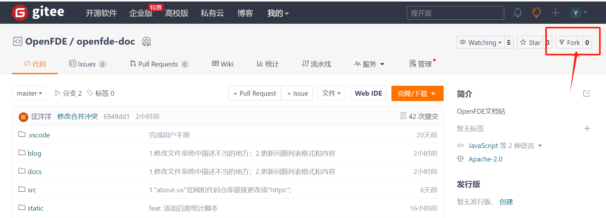
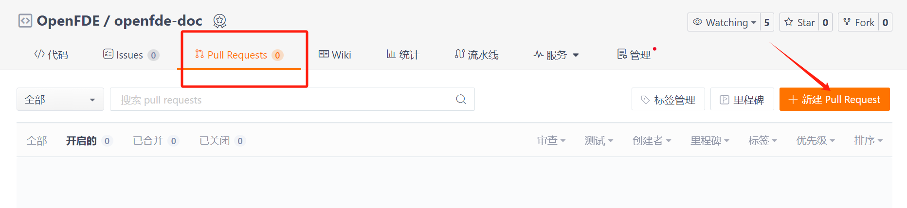
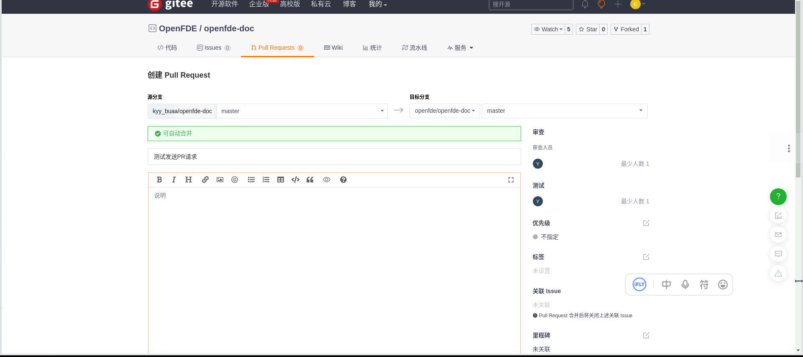

> 在开始编写你自己的博客文章之前，请先详细阅读本篇教程，以方便你后续的工作。

<!-- 本博客站点可以通过[OpenFDE官网](https://openfde.com/)跳转到本博客站点。-->

## OpenFDE博客站点介绍

&emsp;&emsp;欢迎来到OpenFDE博客站点！在本站点你可以尽情发挥你的技术创作文笔、记录你的创新idea或是记录你攻克某一技术难题的思路和方案。欢迎所有OpenFDE社区用户在本站点贡献自己的技术内容！

&emsp;&emsp;当前你看到是本站点的快速指引文档，在本站点的左侧侧边栏会根据**博客创建时间顺序展示**本站点所有的博客文章。下面我们将详细指导你如何参与到OpenFDE社区的博客站点来贡献你自己的内容。

## 如何获取OpenFDE文档资源

### 复制OpenFDE文档仓库

&emsp;&emsp;首先前往OpenFDE的[Gitee](https://gitee.com/openfde/openfde-doc)复制文档仓库到你本地。



&emsp;&emsp;然后就可以通过```git clone```对你这个复制的远程仓库进行克隆，后续你的任何更改都可以在本地完成，通过```git push```命令推到你复制的远程仓库。

### 发送Pull Requests

&emsp;&emsp;如果你想将你新增的内容发布到OpenFDE的文档站上，请向我们发送```Pull Requests```请求。待管理人员审核通过后，就可以将你添加的内容发布到OpenFDE的文档站上了。





当然，在本博客站编写博客文章需要遵循一定的规范，具体规范参见[博客编写规范](./specification)。

