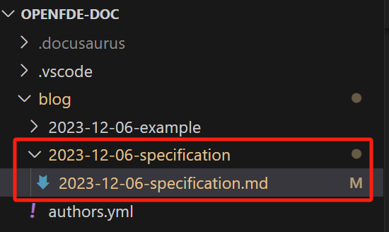

&emsp;&emsp;介绍OpenFDE开源社区发布博客需要遵循的规范，包括如何添加新的博客、博客命名规范和一些常用的编写格式技巧。
<!--truncate-->

> 博客文章源文件以markdown文件为主，遵循markdown编写规则。

## 添加新的博客{#add-new-blog}

&emsp;&emsp;首先在openfde-doc/blog/下创建一个新的文件夹，用来存放你的markdown源文件，文件夹的命名格式统一约定为：```YYYY-MM-DD-blog-title```。



- 本站点基于Docusaurus构建，可以自动提取文件名中的日期，将博客文章按时间顺序进行排列展示。

- 每篇博客创建一个独立的文件夹，可以将你自己的博客文章图片和markdown文件放在一起，方便管理。

## Front Matter{#front-matter}

&emsp;&emsp;每篇博客文章写在前面的话可以自行添加博客标题、作者信息、博客日期等多种元数据信息。示例如下：
```
---
title: 博客标题
descripiton: 简要描述本博客文章
slug: 本博客用于url显示的名字
author: 作者名
tags: [hello, world] # 该博客所属的标签
---
```

## 编辑当前博客{#edit-this-blog}

如果想修改当前的博客内容，你可以点击本文最左下角的```Edit this page```，前往Gitee仓库进行编辑内容。


