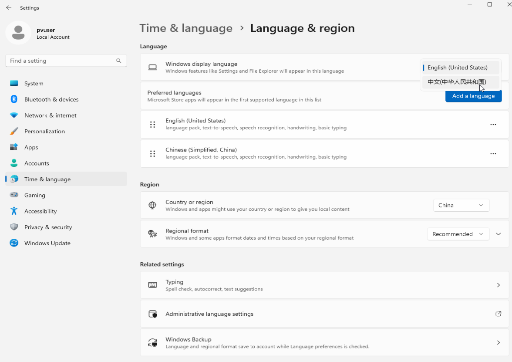

本博客主要介绍如何将Tiny11设置成中文使用。

<!--truncate-->

# Tiny11设置中文报错解决方法

&emsp;&emsp;tiny11安装默认的是英文版本,想要将操作系统设置为中文简体，但是在点击settings->Time&language->Language&region->Add a language->添加中文简体下载报错，针对这个问题，梳理了具体的操作步骤。

## 具体步骤
&emsp;&emsp;总的分为启用windows更新服务、关闭防火墙、下载中文语言包并设置为系统显示语言、重启五大操作，以下为具体操作。

### 启用windows更新服务
1、点击“win”在搜索框内输入"services",打开"Services App"

2、在services应用程序窗口中,查找后台智能传输服务，右键单击它选择属性Properties，如图所示

3、将Startup type修改为"Automatic"或者“Automatic（Delayed Start）”，点击Service status下的“Start”，将其状态修改为running后再点击窗口右下角的“Apply”和“OK”退出选项属性设置

4、在services应用程序窗口中，找到windows更新服务，右键单击它选择属性Properties，如图所示

5、将Startup type修改为"Automatic"，点击Service status下的“Start”，将其状态修改为running后再点击窗口右下角的“Apply”和“OK”退出选项属性设置（如果其中的start不能点击就将Startup type设置为Automatic，修改退出后再右击鼠标点击“start”）

#### 打开防火墙
1、按“win”在搜索框输入control找到控制面板打开

2、找到“Windows Defender Firewall”点击进入

3、点击左列选项中的“Turn Windows Defender Firewall on or off”关闭两项防火墙

### 下载语言包并设置为windows显示语言
1、按“win”选择settings->Time &language->Language&region

2、点击“Add a language”,输入china添加“中文(中华人民共和国)”，点击Next

3、按需要勾选有用的的项后点击“install”，可见已经可以正常下载语言包

ps：Text-to-speed、speech recognition、handwriting 分别是文本转化为语音的包、语音识别的包、手写输入文字的包，没有需求可以不下载，这几个包安装好占4GB左右

4、待下载完成后，在“Windows display language”选择“中文（中华人民共和国）”

### 重启
重启系统可见操作系统已经为中文

### 其他建议
在简体中文下下载好基本输入法才可以输入中文

将“管理语言设置”中“更改修通区域设置”修改为中文，否则安装软件包会出现乱码的情况

