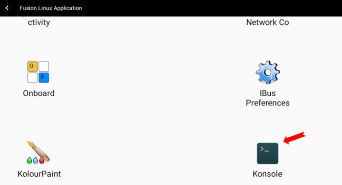
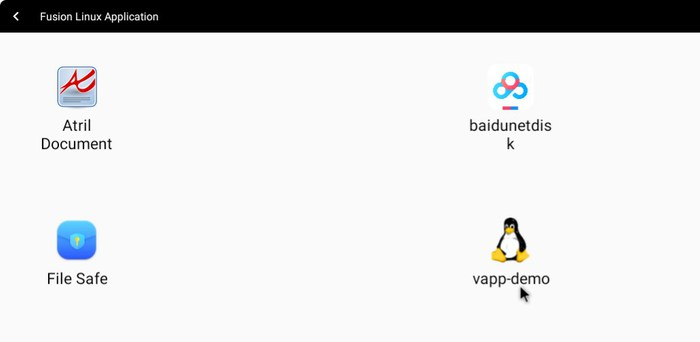
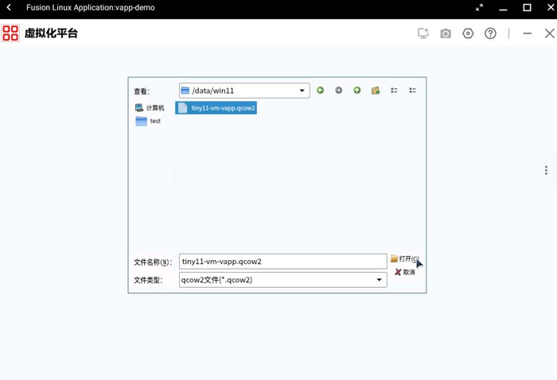
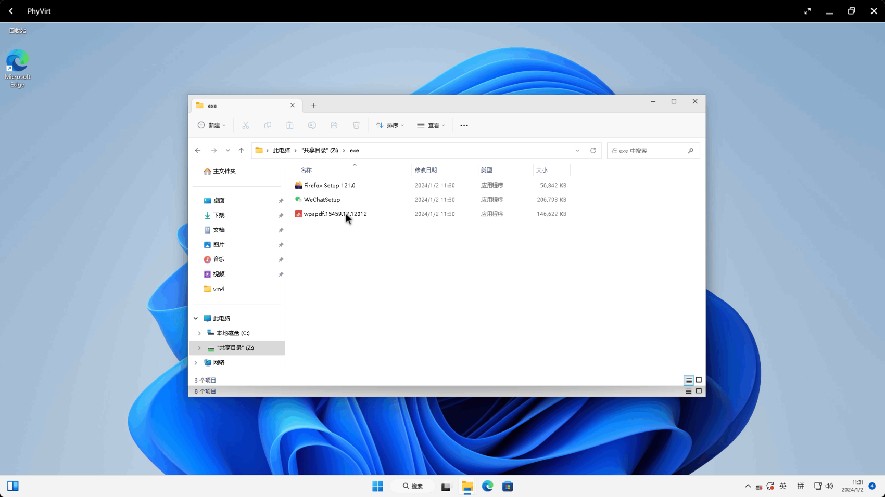
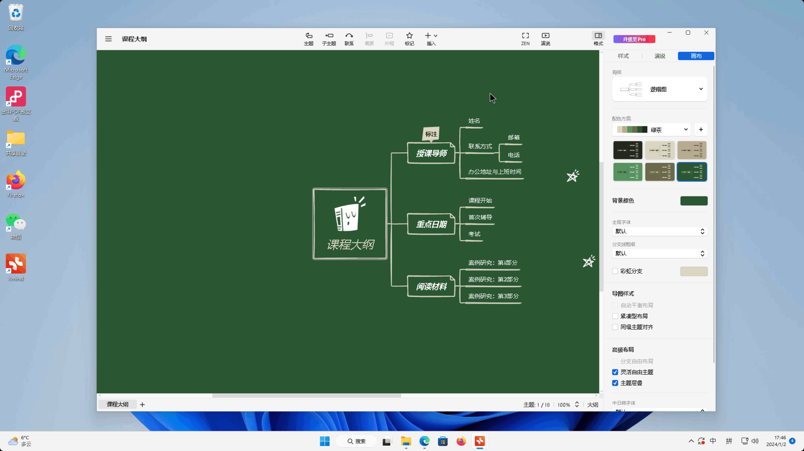
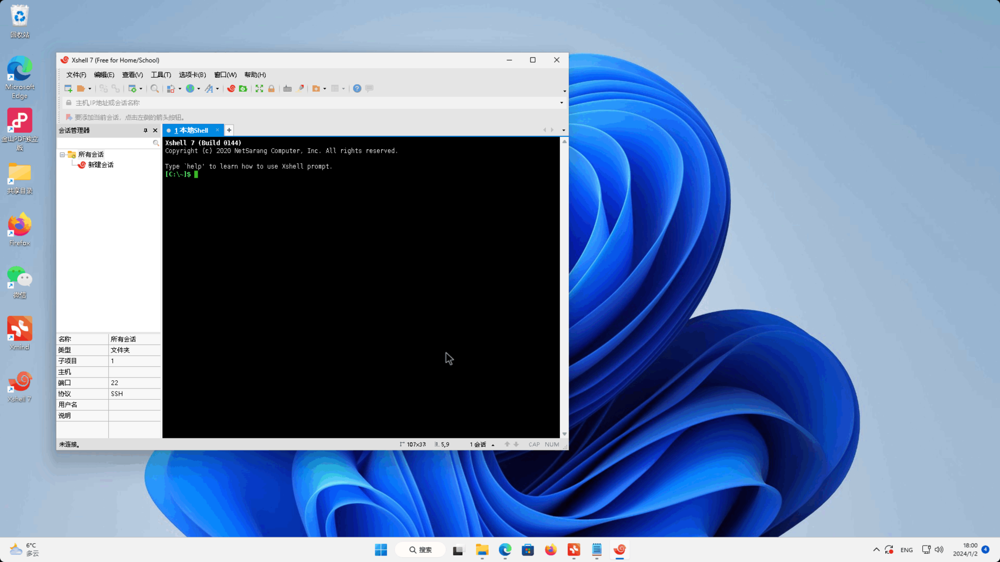

本博客介绍如何在OpenFDE使用win11应用，主要在OpenFDE安装phyvirt-fde，导入已有win11镜像qcow2创建虚拟机，下载win11应用包并安装使用
<!--truncate-->

### 软硬件资源{#resource}

* 内存>8G,硬盘>60G
* Kylin V10 SP1
* phyvirt-fde：
  * 目前版本仅支持Phytium CPU part为0x662和0x663的机器，可使用命令“cat /proc/cpuinfo”查看是否匹配
* win11虚拟机qcow2：tiny11-vm-vapp.qcow2（7.2GB）
  * 使用tiny11制作，它是一款对win11进行极致精简的定制系统,它的特点是在资源受限的情况下，用户依然能够获得流畅的使用体验
  * 该镜像用户名与密码都是pvuser,成功创建虚拟机后可自行修改
  * 文件存放于夸克网盘，下载链接：https://pan.quark.cn/s/d3b9e4cba2b4

### 安装前提{#prerequisites}

OpenFDE已安装完毕并登录OpenFDE桌面

### 搭建步骤{#steps}

1. 在OpenFDE中点击"开始菜单->Fusion Linux Application",找到linux的终端应用Konsole，输入以下命令安装phyvirt-fde
  ```
  sudo apt update
  sudo apt install phyvirt-fde -y
  ```

  

  

2. 在"开始菜单->Fusion Linux Application"中打开vapp-demo
   
  

  
   
3. 点击“基于已有镜像创建”，找到已有的win11虚拟机qcow2文件(tiny11-vm-vapp.qcow2)打开
   
  

  

4. 输入虚拟机名，操作系统类型、CPU数量、内存大小等信息，点击右下角确认创建虚拟机后直接关闭vapp-demo
   
  


5. 在OpenFDE桌面，点击"开始菜单->phyvirt"打开,可见有新建的虚拟机tiny11

  

  

6. phyvirt上启动虚拟机

  

7. 待右下角状态为“就绪”，可点击“RDP”进入虚拟机
  
  


8. 将窗口全屏就可以正常使用了
  
    
  

### 安装应用{#install-applications}
* 方法一
  镜像自带有浏览器Edge,可用此下载软件包安装使用

  

  

* 方法二
  phyvirt中默认的共享目录路径为“~/桌面/share",可将安装包放入其中，在虚拟机中点击安装
  ```
  cp ~/下载/exe/ ~/桌面/share/ -r
  ```
  
  

  

  

### 应用展示{#application-use}
* Xmind
  
  

* Xshell

  

* QQ游戏
  
  

  

### 致谢{#thanks}
感谢飞腾公司小伙伴基于phyvirt基础上，为OpenFDE提供了phyvirt-fde