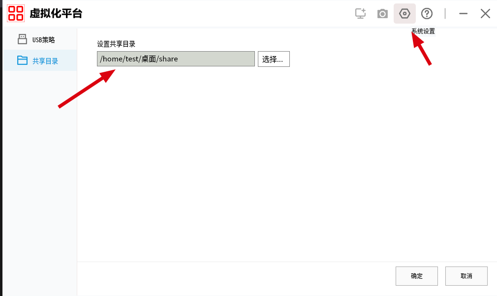

This blog provides instructions on how to use Win11 in an OpenFDE environment. 

<!--truncate-->

# Run Win11 APP

This document provides instructions on how to use Win11 in an OpenFDE environment. The main steps include obtaining the tiny11 image, using phyvirt to install the image as a virtual machine with the operating system language set to Chinese, copying the qcow2 file, and finally attempting to use the virtual machine in the OpenFDE environment. The following section details the process for setting up the environment.

### Software and Hardware Resource

#### Hardware

* 16CPU 
* 16GB MEM
* harddisk:40GB
* kernel: 5.4.18-85-generic
* aarch64
  
#### Software

* Kylin V10 SP1
* phyvirt app ：cn.com.vapp_1.5.6.0_arm64_kylin.deb
* tiny11 virtual machine qcow2：tiny11_20231221_114340.qcow2
* vapp iso:vapp-v1.5.6.0-20231107-1540.iso
    * After successfully installing vapp, it is now located at /opt/apps/cn.com.vapp/files/iso/vapp-v1.5.6.0-20231107-1540.iso
* Virtual machine for Android:android-build-release-signed.apk
    * After successfully installing vapp, it is now located at /opt/apps/cn.com.vapp/files/android-build-release-signed.apk
* Remote Desktop for Android: aFreeRDP-release.apk
    * After successfully installing vapp, it is now located at /opt/apps/cn.com.vapp/files/aFreeRDP-release.apk

### Prerequisites

Openfde is installed and working fine

### Steps

1. In Kylin, double-click on "cn.com.vapp_1.5.6.0_arm64_kylin.deb", and click on "One-click Install". After entering the PC password in the prompted Kylin authorization window, the installation process will begin.
   


2. After installation, you can find "vapp-demo" in the application list. Click on it to open. In the system settings, you can see that the default shared directory for the virtual machine is "/home/test/Desktop/share".
   


3. Copy the vapp image file to the shared directory for execution within the virtual machine.
   
```
mkdir -p  ~/desktop/share/vm4 
cp /opt/apps/cn.com.vapp/files/iso/vapp-v1.5.6.0-20231107-1540.iso ~/desktop/share/vm4
```
4. Click on "Create Based on Existing Image" and locate the existing qcow2 file of the tiny11 virtual machine. I have placed it in "/mnt/tiny11/" directory. Select any qcow2 file in the specified path to open.
   


5. Enter the virtual machine name, operating system type, CPU quantity, memory size, and other relevant information. Then, click on the confirmation button in the bottom right corner to start creating the virtual machine.
   


6. Wait for the status in the bottom right corner of the virtual platform to change from "Not Ready" to "Ready". Click on "Debug Desktop" to open the virtual machine desktop. Please note that at this point, the current user is the default user of the virtual machine, which is "pvuser" (both the username and password are "pvuser").
   


7. Open the shared directory and locate the vapp image file "vapp-v1.5.6.0-20231107-1540.iso" that was copied in step 3. Double-click to open it.
   


8. Run "phyvirt-app-v1.5.5.0-2023117-1536.exe" as an administrator.


9. After the installation is complete, you need to wait for the corresponding driver installation to finish. A window will appear asking if you want to restart the system. Click "Yes" to restart the system.


10. Log out of the Kylin desktop and enter the OpenFDE desktop. Click on the Start menu, then go to "Fusion Linux Application" and find the Linux terminal application called "Konsole".
    


11. Enter the following commands in Konsole to install the Android version of the virtual machine and the Android version of the remote desktop.

```
waydroid app install /opt/apps/cn.com.vapp/files/android-build-release-signed.apk
waydroid app install /opt/apps/cn.com.vapp/files/aFreeRDP-release.apk 
```


12. Click on the Start menu and then navigate to the "phyvirt" application. You should see the virtual machine "tiny11" that was created on Kylin.


13. Start the virtual machine on phyvirt in OpenFDE.


14. Wait for the status in the bottom right corner to change to "Ready". Then, click on "My Desktop" to enter the virtual machine.


15. To use it normally, you can go fullscreen by maximizing the window.
    


1.  Now you can install the corresponding applications by transferring the installation packages through the shared directory or downloading software packages using a browser for installation and use.


If you want to learn how to sinicize tiny11, head over to the [chinese-tiny11](./../2023-12-22-chinese-tiny/chinese-tiny11.md)