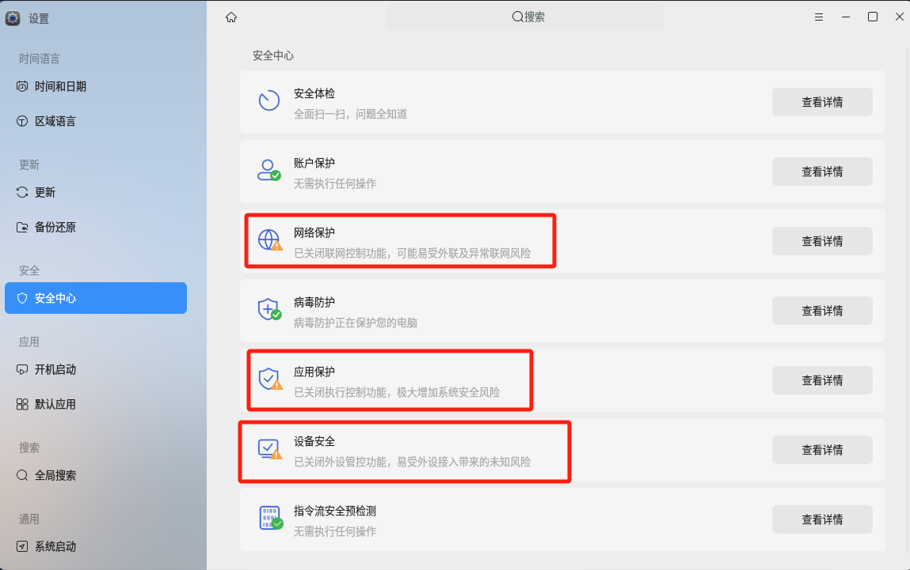
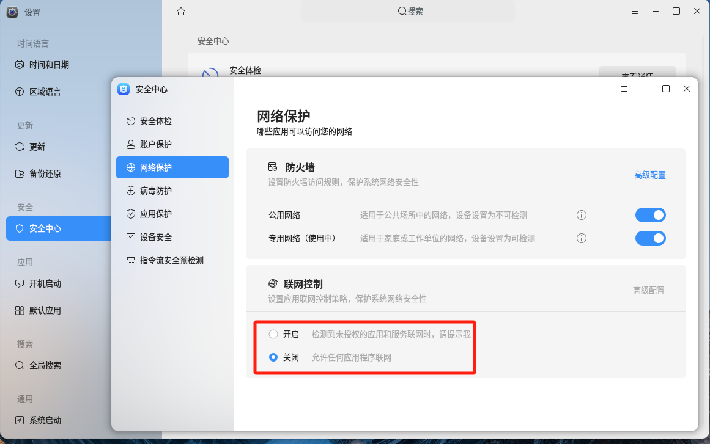

# Quick Start{#quick-start}

This document is intended to guide OpenFDE enthusiasts on how to quickly compile the OpenFDE source code. The comilation process includes building AOSP code and compiling Linux programs.

## 1. Build AOSP Source Code{#aosp-build}

### 1.1 Preparation {#preparation}

To compile the AOSP source code, it is recommended to have a <mark>multi-core X86 host with a minimum requirement of 16GB of RAM and at least 512GB of disk space</mark>. It is highly recommended to prioritize using a solid-state drive (SSD) for better compilation speed. However, you can also use a traditional hard disk drive (HDD), but the compilation process may be slower.

### 1.2 Install Ubuntu22.04{#install-ubuntu22.04}

Once you have prepared the host machine, you need to install Ubuntu 22.04 in your environment. Here is a friendly download link for the Ubuntu 22.04 installation image: https://mirrors.tuna.tsinghua.edu.cn/ubuntu-releases/22.04.3

### 1.3 Install And Update Repo{#install-repo}

Android typically uses the repo script to manage the source code tree. repo is a tool written in Python that simplifies the process of downloading and managing multiple code repositories in the AOSP project. 

- Install curl、repo、wget
  
```
sudo apt install curl repo wget -y
```

- Get the script files

```
curl https://mirrors.tuna.tsinghua.edu.cn/git/git-repo -o repo && chmod +x repo && sudo mv repo /usr/bin/repo
```

- Create a symbolic link from Python 3 to Python

```
sudo ln -sf /usr/bin/python3 /usr/bin/python
```

- Set the `repo_url` environment variable for future repo updates, you can use the following command:

```
export REPO_URL='https://mirrors.tuna.tsinghua.edu.cn/git/git-repo'
```

- Add `repo_url` to the bash environment variable
  
```
echo export REPO_URL='https://mirrors.tuna.tsinghua.edu.cn/git/git-repo' >> ~/.bashrc
```

### 1.4 Install Dependencies{#install-dependencies}

```
sudo apt install -y python-is-python3 git-core gnupg flex bison gperf build-essential zip curl zlib1g-dev gcc-multilib g++-multilib libc6-dev-i386 lib32ncurses5-dev x11proto-core-dev libx11-dev lib32z-dev libgl1-mesa-dev libxml2-utils xsltproc unzip libncurses5 simg2img meson glslang-tools pkg-config cmake python3-mako
```

### 1.5 Download the source code{#download-source-code}

Note: Starting from this section, please **switch to a regular user account** for all subsequent operations. Do not continue as the root user.

- Create the `fde` directory and install git

```
mkdir fde && cd fde && sudo apt install git git-lfs -y
```

- Config the account and email of git

```
git config --global user.name openfde && git config --global user.email openfde@openfde.com
```

Please remember to replace the "user.name" parameter with your own username and the "user.email" parameter with your own email address.

- Download the manifests repository
  
```
repo init -u https://gitee.com/openfde/manifests -b 1.0.6 --git-lfs
```

This step will initialize the Android source code tree directory structure according to the FDE manifests repository. The `-u` flag specifies the URL from which to retrieve the manifest repository, and the `-b` flag specifies the code version. The current OpenFDE code version is 1.0.6.

When executing this command `repo init`, it is possible to encounter ```Testing colorized output (for 'repo diff', 'repo status'): black red green yellow blue  magenta cyan  white bold  dim ul reverse Enable color display in this user account (y/N)? ```. At this point, simply input 'y' to proceed with the execution.

  
- Synchronize the latest code from the code repository.
  
```
repo sync -j4 
```

The command will take approximately 50 minutes to complete. Please be patient and wait for the process to finish. However, please note that the actual duration may vary depending on the network conditions of your specific environment. If the execution fails, you can try running the command again until it succeeds.

### 1.6 Compile the source code{#build-source-code}

- Import the Android build environment variables
  
```
source build/envsetup.sh
```

- Synchronize the source code of apk

```
syncFdeApk
```

The command `syncFdeApk` will download the APK matching the current version from the public object storage to the corresponding location in the AOSP source tree. If you make any modifications to the APK source code, you will need to recompile the APK source. Please refer to [Android APK Compilation](./build-android-apk) for instructions.

- Select the compilation options and execute the build using 24 threads.
  
```
lunch 44 && make -j24
```

The entire compilation process typically takes around 1 hour and 10 minutes. If the process is interrupted at any point, you will need to start the entire compilation process again from the step of "Importing Android build environment variables" by running the command `source build/envsetup.sh`. This will ensure that the build environment is properly set up before proceeding with the compilation.

<mark>If you encounter the compilation error shown in the image below during the build process, please ignore it as it does not affect the compilation process.</mark>


### 1.7 Convert the image format to Linux ext format{#to-linux-ext}

```
cd  out/target/product/fde_arm64/ && simg2img system.img system.ext.img && simg2img vendor.img vendor.ext.img
```

### 1.8 Copy the images to the target{#copy-img}

```
scp system.ext.img vendor.ext.img user@target:
```

`user@target：` refers to an ARMv8 environment for compiling Linux programs, where 'user' represents the account name and 'target' represents the IP address of the machine. <mark>Make sure to include the colon ':' at the end!</mark>

## 2. Compile Linux Programs{#build-linux}

### 2.1 Prerequisities{#requirements}

To compile Linux programs, it is necessary to perform the compilation on a host machine with **ARMv8 architecture**. You need to select a project directory to compile and install Linux-related programs. All the subsequent steps should be performed within the project directory, such as `openfde-linux/`. <mark>If it is not the first time compiling, please ensure that the code for all the dependent libraries is synchronized and updated to the latest version.</mark>

Below, we will provide detailed instructions on how to compile Linux programs on different operating systems.

### 2.2 Compile Linux Programs on Kylin2303{#build-linux-on-kylin2303}

#### 2.2.1 Settings{#settings}

Before starting the compilation process, please go to System Settings -> Security and disable Network Protection, Application Protection, and Device Security Protection.





#### 2.2.2 Quick Compilation{#quick-build}

You can execute the following command to compile Linux programs with a single command.

```
cd ~ && sudo apt install git -y && git clone https://gitee.com/openfde/quick_start_to_compile_linux_programs && cp -a quick_start_to_compile_linux_programs/build_linux_for_fde.sh . && ./build_linux_for_fde.sh
```

If you want to learn more detailed compilation process and information, please visit [Compiling Linux Programs on Kylin2303](./build-linux/build-linux-on-kylin2303).