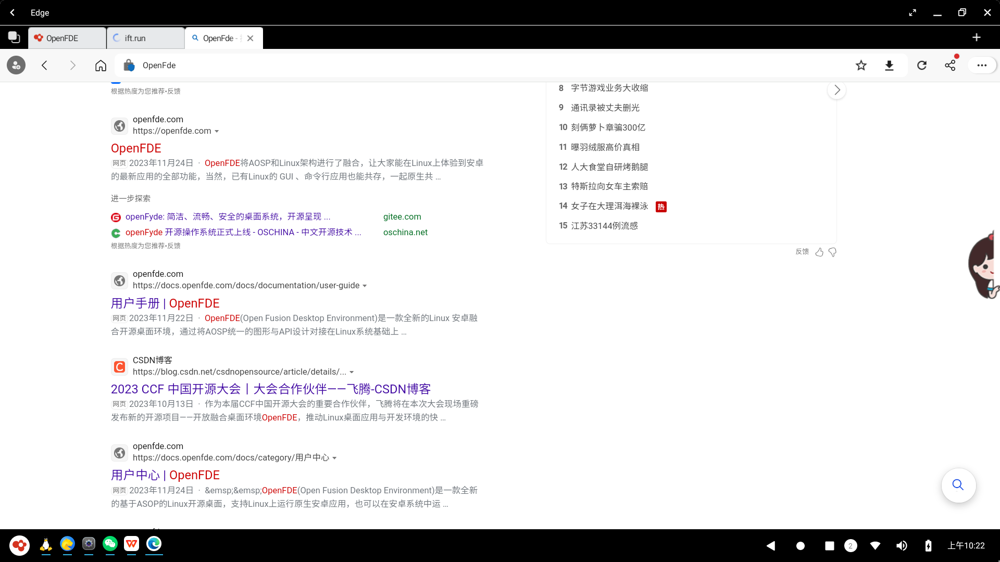
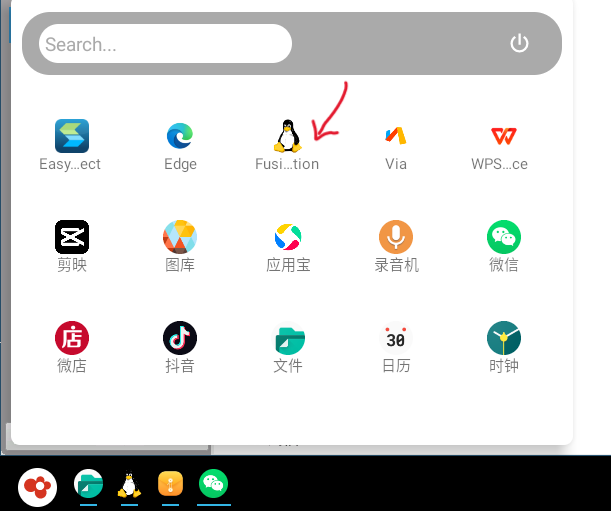

# APP Recommendation Guide{#agguestion-app}

This article is a practical guide! Here, I would like to recommend some essential software applications for office, social, and daily life purposes, helping you make the most of OpenFDE for work and entertainment. **Before diving into the following recommendations**, make sure you have installed the App Store on your OpenFDE. If it is not installed yet, you can download and install the App Store using the built-in Via browser.

| Category | App Lists |
|  :----:  |    :----:   |
| Office | Baidu Netdisk, [WPS Office](#wps-office), QuickShot, Wink, Butter Camera, Baidu Browser, [Tencent Meeting](#tecent-meeting), [Edge Browser](#edge)  |
| Games	 | Happy Landlord, Clash of Clans, Cut the Rope 2 |
|Lifestyle | NetEase Cloud Music, Zhihu, Bilibili, Tencent Video, Xiaohongshu, Douyin, Kwai| 
| Shopping | Pinduoduo, [XianYu](#xianyu), [WeiDian](#weidian) |
| Social | 	WeChat, QQ |

## Office Applications{#work-app}

### WPS Office

For office software related to working, we recommend installing WPS Office from the App Store. Once installed, shortcuts for WPS Office will be automatically created in the start menu and on the desktop. You can open the application quickly by clicking on any of these shortcuts.

You can click on the top right corner of the window to make the WPS Office application full screen or maximize it. This way, you can conveniently start working on various types of documents!

### Edge Browser{#edge}

Daily office tasks often require a web browser. We recommend installing the Android version of Microsoft Edge from the AppGallery. Once installed, you can find shortcuts for Microsoft Edge in the start menu and on the desktop. Open the application and click on the full-screen or maximize button to quickly embark on your various internet search journeys.

### Image and Video Editing{#edit-pictures}

Perhaps you have needs for image editing, video production, or video editing. We recommend installing Meitu Xiuxiu or Jianying from the App Store. OpenFDE supports these two image and video editing apps very well.

Similarly, you can make the application full screen or maximize it. Compared to using these apps for editing on a mobile phone with limited screen space, OpenFDE allows you to maximize these applications. You can use a mouse to smoothly perform image or video editing tasks!

### Konsole{#konsole}

One of the great features of OpenFDE is the integration of Linux applications, which allows you to directly run Linux applications on Android. This includes running Linux commands in a Linux terminal.

You can find the icon for Linux integration applications in the "Start Menu" to open the Linux integration desktop.

In the Linux application list, you may come across two terminal applications: MATE Terminal and Konsole. Both terminal applications can be used to execute Linux commands. **We recommend using Konsole**.

**Reason for Recommendation:** MATE Terminal may have issues with cursor positioning when entering Linux commands. However, our future updates and improvements will address this. Therefore, we suggest choosing the smoother experience of Konsole!

### Tecent Meeting{#tecent-meeting}

OpenFDE supports the Android version of Tencent Meeting. You can go to App Store to directly download Tencent Meeting. In OpenFDE, you can use Tencent Meeting to join a meeting, start a quick meeting, schedule a meeting, etc. You can also share the screen, record the meeting process, etc. In short, the Tencent Meeting functions you can use on your mobile phone can also be used with OpenFDE!

## Lifestyle Applications{#life-app}

As we all know, many lifestyle apps rarely provide desktop versions, and only Android clients can be used, such as Xianyu, Weidian, etc. But our OpenFDE allows you to use these apps as usual on your computer and fully use various application functions on Android.

### XianYu{#xianyu}

You can go to the App Store to download Xianyu, find the Xianyu shortcut in the start menu and open Xianyu. Please note here, **you may encounter** when opening Xianyu for the first time:

- The standard window Xianyu app may not display the maximize and minimize buttons, and the user agreement "Agree" button may not be displayed when you first enter the Xianyu app. This is because Xianyu does not support free window mode. **You can place your mouse on the top, bottom, left and right bounding boxes of the app, and drag the app window wider or longer. **
- Of course, there may be a crash when you drag the window. Don’t worry! This is a normal phenomenon. Try opening the Xianyu app again. What will appear again is the effect after you drag the window to a larger size until the minimize, maximize, and full-screen function buttons appear in the upper right corner.
- During the process of browsing products, if the app window is dragged too far, some blank areas will appear. If the window is too small, some product columns may not be fully displayed. You can continue to drag the window until it just meets your browsing page and usage needs.

Anyway, if you encounter a crash problem while using Xianyu, don't panic, just drag the window a few more times and try to reopen Xianyu a few more times and you can use it normally!

### WeiDian{#weidian}

The installation methods of Weidian and Xianyu are similar. They only need to be installed and opened normally before they can be used normally. Weidian supports free window mode and can be maximized and full screen normally, so feel free to use it!

