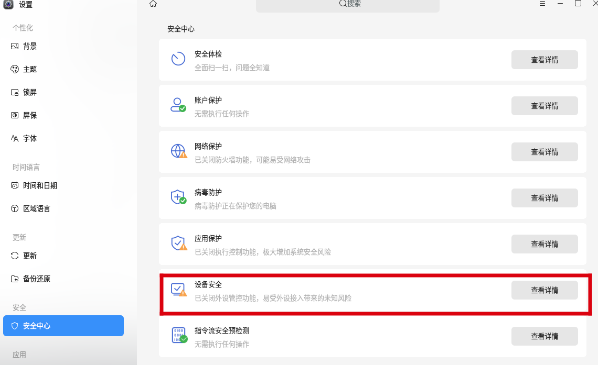
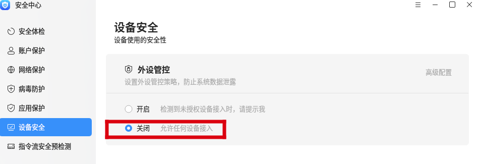
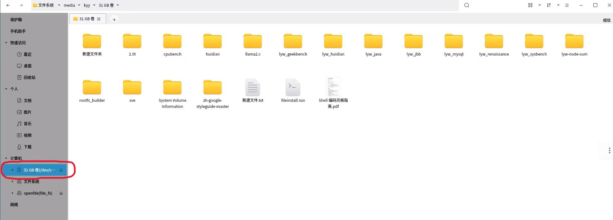
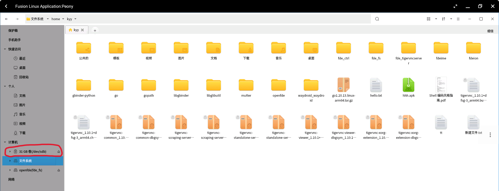

# Tutorial: How to Use External Devices

## Settings{#settings}

First, you need to disable the peripheral control of the Kylin/Ubuntu system by going to "Settings - Security Center - Device Security."

Set the peripheral control button to "Off".

## Connecting and Using a USB Flash Drive{#using-usb-flash-drive}

After inserting the USB flash drive into the USB port, click on the OpenFDE icon in the bottom left corner of the desktop to open the Linux Fusion Application in the application menu.

Select the file manager application "Peony" to open it.

In the left sidebar of the file manager, you can see the recognized USB flash drive under the "Computer" section.

### File Transfer for USB Flash Drive {#transfer-for-usb-file}

You can copy files from the USB flash drive to the Linux file system, or directly to the Android file system "openfde" (fde_fs).

- Copy USB flash drive files to the Linux file system.

In the directory of the USB flash drive (in this example, the USB drive is named "31GB Volume"), select the file or folder you want to copy. Click on "Copy". Then navigate to the `/home/kyy/` directory in the "File System" and paste the files or folder to successfully copy them. <mark>Note: The files or folders being copied should not be empty. Additionally, it is recommended to choose a destination path within your home directory in Linux, as other directories may have restricted access permissions.</mark>

- Copy USB flash drive files to the Android file system.

Select the file or folder you want to copy in the directory of the USB flash drive. Click on "Copy". Then navigate to the `openfde(fde_fs)` directory and paste the files or folder to the desired destination path. <mark>Please note that the files or folders being copied should not be empty.</mark>

> It is important to note that when copying files and folders from the USB flash drive to the Android file system `openfde(fde_fs)`, Peony file manager only supports read access. If you wish to edit or modify the files copied from the USB flash drive, please open the Android file manager "Files" from the application menu and locate the target file or folder to perform the desired operations.