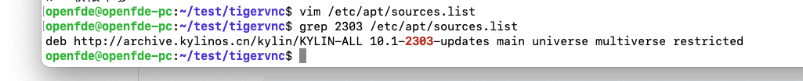

# Install OpenFDE on Phytium X100 

This guide includes two sections: [Installing OpenFDE on Kylin](#install-on-kylin) and [Installing OpenFDE on Ubuntu](#install-on-ubuntu).

## 1. Install OpenFDE on Kylin{#install-on-kylin}

### 1.1 Check Kernel Version{#kernel-requirements}

- If your kernel version is lower than 5.4.18-85, please [upgrade your kernel version](#upgrade-kernel) first.

- If your kernel version is 5.4.18-85 or higher, please click directly on the link to proceed with the [fdeion-dkms installation](#install-fdeion-dkms)

#### Upgrade Kernel{#upgrade-kernel}

- Check if the source list is up to date

```
grep 2303 /etc/apt/sources.list
```

If the results obtained from `grep` include the source list for version 2303, you can skip the following step of updating the source list.



- Update the source list
  
```
echo deb http://archive.kylinos.cn/kylin/KYLIN-ALL 10.1-2303-updates main restricted universe multiverse | sudo tee /etc/apt/sources.list.d/v10sp12303.list
```

- Get the latest package.
  
```
sudo apt-get update -y
```

- Upgrade all the packages that can be upgraded
  
```
sudo apt-get full-upgrade -y
```

- Remove unnecessary software
  
```
sudo apt-get autoremove -y 
```

- Reboot your system: <mark>Please make sure to restart your system so that the new kernel takes effect before installing OpenFDE.</mark>

```
sudo apt-get autoclean -y && reboot
```

Once the kernel version upgrade is completed, continue with the [installation of fdeion-dkms](#install-fdeion-dkms)

### 1.2 Install fdeion-dkms{#install-fdeion-dkms}

If you have previously installed OpenFDE, after upgrading the kernel version, you need to first clean up the old fdeion-dkms. 

```
sudo apt purge fdeion-dkms
```

If you haven't installed OpenFDE before, you can proceed with the installation of fdeion-dkms directly.

```
sudo apt install fdeion-dkms
```

### 1.3 Disable Security Controls

To ensure a smooth installation and startup of OpenFDE, before you begin installing OpenFDE, you need to disable all security controls on your current system. In your current system, go to Settings and navigate to Security. Enter the Security Center or Security Settings.


Using network control as an example, you should disable application internet access control. Additionally, it is recommended to disable controls related to application protection and device security.


### 1.4 Configure Installation Source And Certificates{#prerequisites}

When installing OpenFDE for the first time, you will need to obtain the complete software source and configure the installation source and certificates.

**Note**: <mark>If this is not your first time installing OpenFDE</mark>, you can skip the "Configure Installation Source and Certificates" section and proceed directly to the [installation steps](#installation).

#### 1.4.1 Install wget and gpg{#install-wget-gpg}

```
sudo apt-get install wget gpg
```

#### 1.4.2 Download the encryption key file from the official website and decrypt it locally{#download-keys}

```
wget -qO-  http://openfde.com/keys/openfde.asc | gpg --dearmor > packages.openfde.gpg
```

#### 1.4.3 Copy the decrypted key file to the key folder of your local apt tool{#decrypted-keys}

```
sudo install -D -o root -g root -m 644 packages.openfde.gpg /etc/apt/keyrings/packages.openfde.gpg
```

#### 1.4.4 Configure the software repository address for OpenFDE{#config-source-address}
 
```
sudo echo \
  "deb [arch="$(dpkg --print-architecture)" signed-by=/etc/apt/keyrings/packages.openfde.gpg] http://openfde.com/repos/kylin/ \
  "$(. /etc/os-release && echo "$PROJECT_CODENAME")" main" | \
  sudo tee /etc/apt/sources.list.d/openfde.list > /dev/null
```

#### 1.4.5 Delete the downloaded key file{#remove-keys}

```
rm -f packages.openfde.gpg
```

### 1.5 Install OpenFDE{#installation}

#### 1.5.1 Update Software Source{#apt-update}

```
sudo apt-get update
```

#### 1.5.2 Install OpenFDE{#install-openfde}

```
sudo apt-get install openfde 
```

### 1.6 Upgrade OpenFDE{#update-openfde}

Firstly update the software source.

```
sudo apt-get update
```

Upgrade OpenFDE to the latest version.

```
sudo apt-get install openfde
```

## 2. Install OpenFDE on Ubuntu{#install-on-ubuntu}

Adaptation is still under research, and further updates will be added in the future.