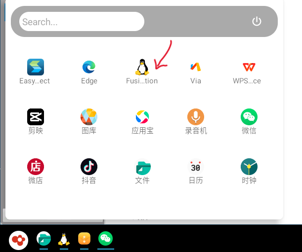
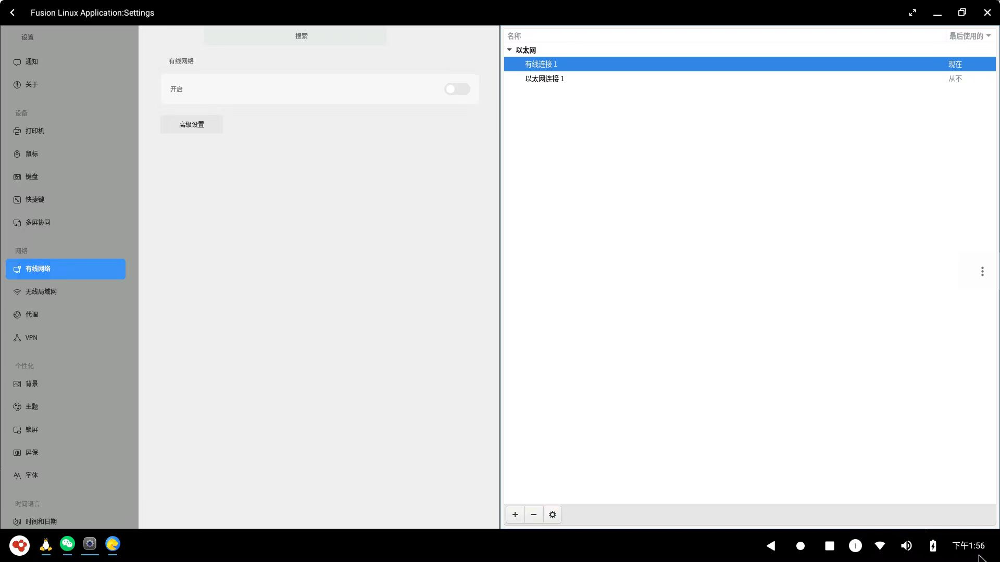
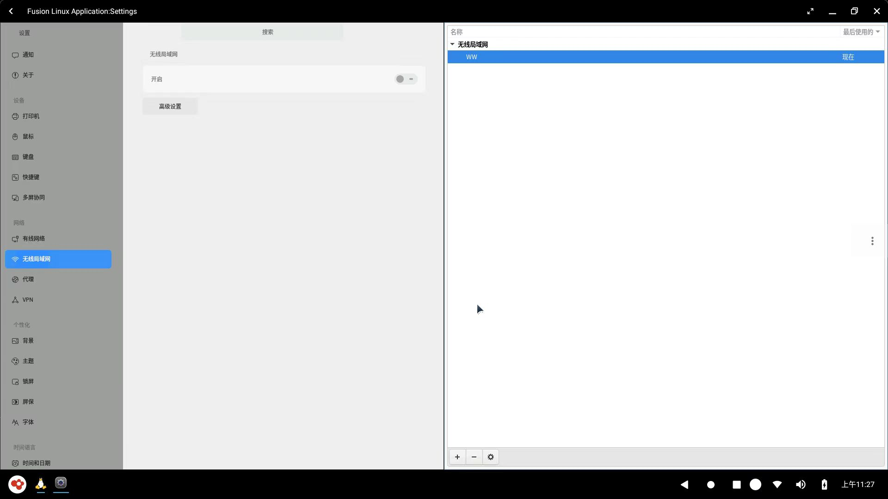
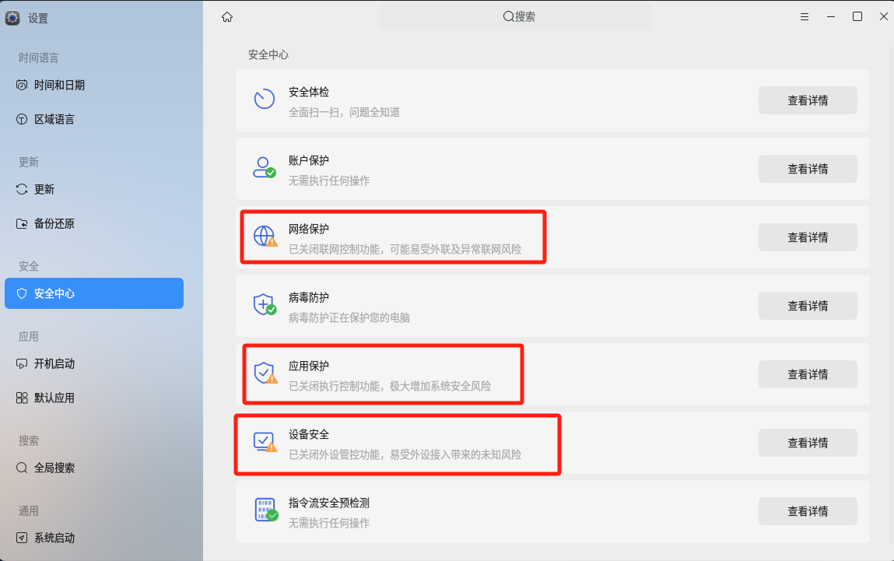
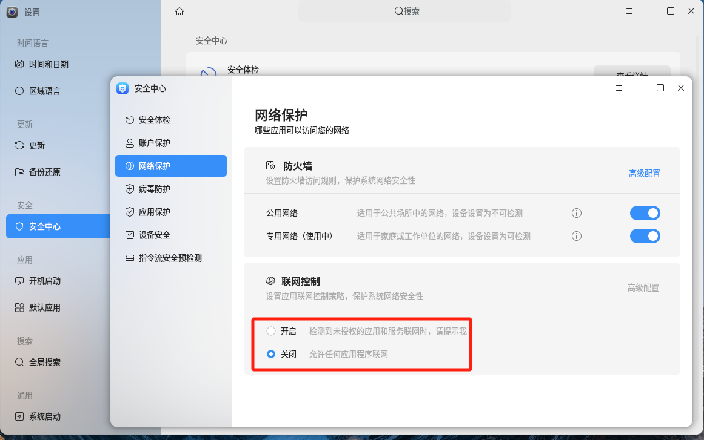

# 快速入门

&emsp;&emsp;OpenFDE(Open Fusion Desktop Environment)是一款炫酷的Linux开源桌面。它可以让你在Linux系统上玩安卓的软件，也可以在安卓系统中畅玩Linux应用。

&emsp;&emsp;现在让我来带领你们一起轻松愉快地探索OpenFDE吧！本指南将带你快速了解OpenFDE，让你可以在工作和娱乐中畅享它的魅力。这个过程简单又有趣！准备好了吗？

## 一、安装准备

在开始安装OpenFDE之前，你要检查你的电脑是否符合下面的配置要求：

**硬件要求:**
- 处理器：飞腾D2000、FT2000/4
  
**PS:** 目前我们在飞腾生态中研究、开发并适配了上述两种CPU型号，也欢迎大家自行研究探索，让OpenFDE可以适配更多种类的CPU！你可以前往[构建与开发](./../developer/Quick-Start)去开始你的开发研究。

- 显卡：AMD Radeon、Phytium X100
- 内存：最少8GB，如果你想享受更流畅的体验，推荐选择16GB及以上

**软件要求**
- 操作系统：我们目前研究适配了**麒麟、统信、ubuntu**三种操作系统，其他Linux 操作系统尚未完全适配和测试。

不过，如果你愿意的话，你可以尝试手动编译安装，试试将OpenFDE安装在其他的操作系统上，有更好的想法可以去[这里](https://groups.io/g/openfde/topics)跟大家交流讨论，期待听到你的反馈！

## 二、安装步骤

&emsp;&emsp;让我们以麒麟操作系统为例，首先确保你已经打开了你当前系统的终端界面，执行下列命令一键安装：

```
curl -fsSL https://openfde.com/getopenfde/get-openfde.sh -o get-openfde.sh && sudo sh ./get-openfde.sh
```
在安装过程中可能会要输入"y"进行确认，你只需要按照提示正常输入就可以了。更多详细的安装步骤可以参考[安装指引](./installation-guide)

<!-- 
- 对于ubuntu系统
```
sudo echo \
  "deb [arch="$(dpkg --print-architecture)" signed-by=/etc/apt/keyrings/packages.openfde.gpg] http://openfde.com/repos/ubuntu/ \
  "$(. /etc/os-release && echo "$VERSION_CODENAME")" main" | \
  sudo tee /etc/apt/sources.list.d/openfde.list > /dev/null
```
-->

## 三、畅快使用

### 1. 登录与注销

#### 1.1 登录

- 进入登录页面：首次安装OpenFDE完成后，注销您的当前系统，进入到登录界面，此时在系统图标处可以看到新增有OpenFDE的选项。
  


- 切换登录系统：点击"FDE"后，既可切换到OpenFDE桌面环境进行登录。OpenFDE的账户和密码与您当前系统的账户密码是一致的。

&emsp;&emsp;**注意：** 这里首次选择"FDE"输入密码登录时可能会又跳回当前登录界面，再次输入密码登录即可成功登录进OpenFDE。登录OpenFDE成功后，可以看到OpenFDE的启动画面。


#### 1.2 注销

&emsp;&emsp;点击开始菜单，点击右上角的电源键按钮，会依次出现三个按钮，依次为关机、重启、注销。点击注销按钮即可退出到登录界面。


### 2. 配置输入法

&emsp;&emsp;OpenFDE内置默认输入法为讯飞输入法，在"开始菜单"中找到"讯飞输入法"，即可快速打开讯飞输入法。选择启用讯飞输入法，同意隐私条款概要，即可自行配置输入键盘、键盘布局和皮肤字体等。

### 3. 配置网络

&emsp;&emsp;OpenFDE可以直接使用外部系统(麒麟/统信/ubuntu)等网络，用户可以点击左下角的OpenFDE图标，打开"开始菜单-Fusion Linux Application"，找到Linux的Settings, 在linux设置中配置系统的网络。

 

#### 3.1 有线网络配置

在有线网络中点击高级设置，在右侧弹出以太网的设置窗口：
- **添加新的有线网络**：点击左下角的"+"即可添加新的有线网络连接。
- **配置现有的有线网络**：选中需要修改配置的有线网络连接，点击左下角"设置"按钮，即可弹出窗口修改当前网络连接的配置。



#### 3.2 无线网络配置

在无线网络中点击高级设置，在右侧弹出无线局域网的设置窗口：
- **添加新的无线网络**：点击左下角的"+"即可添加新的无线网络连接。
- **配置现有的无线网络**：选中需要修改配置的无线网络连接，点击左下角"设置"按钮，即可弹出窗口修改当前网络连接的配置。



### 4. 关闭安全控制

&emsp;&emsp;为使用OpenFDE过程更顺畅，建议您关闭电脑的安全控制。具体操作如下：

- 注销OpenFDE退出到登录界面，切换到您之前的操作系统(如麒麟操作系统)登录进去。在麒麟系统中选择设置-安全，进入安全中心。
  


以网络控制为例，关闭应用联网控制。同时，建议您关闭应用保护、设备安全的相关控制。



### 5. 安装应用

#### 5.1 安装安卓应用

安装安卓应用有两种方式：

- 方式一：OpenFDE内置via浏览器，在“开始菜单”中打开via浏览器，可以直接在浏览器搜索想要安装的应用软件包。
- 方式二：使用方式一安装安卓应用市场如"应用宝"，再从应用宝中安装各种安卓应用。

#### 5.2 安装linux应用

&emsp;&emsp;OpenFDE融合Linux应用到安卓系统中，内置独立的Linux融合应用窗口。在开始菜单点开企鹅图标"Fusion Linux Application"，就可以打开Linux融合应用窗口。Linux融合应用窗口和正常的Linux图形系统使用方式是一样的，可以直接运行Linux GUI、命令行等，这里不再赘述。

## 四、更多了解

你可以继续使用OpenFDE来帮助你办公和娱乐啦！更多详细的使用指导参见[用户手册](./user-guide)。