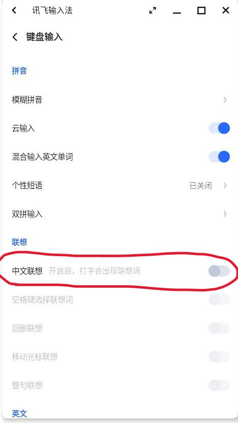

# Quick Start

OpenFDE is a new Linux desktop environment design exploration project. Similar to KDE and GNOME, it aims to provide a cohesive Linux desktop experience from login to running applications. However, what sets OpenFDE apart is its graphical component based on AOSP (Android Open Source Project), which brings a richer ecosystem of applications and games to Linux. It offers a consistent user experience with Android and Linux applications and introduces a unified and innovative approach to Linux desktop application development, providing a fresh perspective on using Linux desktop environments.

<video width="720" height="405" controls>
    <source src="/img/install-guide.mp4" type="video/mp4" />
</video>

## 1. System Requirements{#system-requirements}

We have researched and adapted OpenFDE to support installation on various hardware platforms and operating systems. Currently, we have identified the following hardware platforms and operating systems. Please ensure that your device meets one of the following requirements.

<table style={{textAlign: 'center'}}> 
  <tr>
    <th>Hardware</th>
    <th>Graphics</th>
    <th>Operating System</th>
    <th>Kernel</th>
    <th>Storage</th>
  </tr>
  <tr>
    <td rowspan="2">Phytium D2000、FT2000/4</td>
    <td rowspan="2">AMD Radeon</td>
    <td>Galaxy Kylin V10(SP1) 2203/2303(ARM64)</td>
    <td><font color="Red">linux-5.4.18-53 and above</font></td>
    <td>Minimum 8GB. Recommended 16GB or higher</td>
  </tr>
  <tr>
    <td>Ubuntu(ARM64)</td>
    <td>/</td>
    <td>/</td>
  </tr>
  <tr>
    <td>Phytium X100 Notebook</td>
    <td>Phytium X100</td>
    <td>Galaxy Kylin V10(SP1) 2303(ARM64)</td>
    <td><font color="Red">linux-5.4.18-85 and above</font></td>
    <td>Minimum 8GB. Recommended 16GB or higher</td>
  </tr>
  <tr>
    <td>Rapberry Pi</td>
    <td>/</td>
    <td>Ubuntu(ARM64)</td>
    <td>/</td>
    <td>/</td>
  </tr>
</table>

- If your device meets the above requirements, you can proceed with the following steps for a quick installation.

- <mark>If your device does not meet the requirements mentioned above, please make sure to upgrade your device first!!!</mark> 

- For **Phytium X100 kernel upgrade**, we have provided a detailed tutorial. Please click [here](./install-details/install-on-x100) for the installation details of OpenFDE on Phytium X100.

## 2. Disable Security Controls{#close-security-control}

To ensure a smooth installation and startup of OpenFDE, before you begin installing OpenFDE, you need to disable all security controls on your current system. In your current system, go to Settings and navigate to Security. Enter the Security Center or Security Settings.


Using network control as an example, you should disable application internet access control. Additionally, it is recommended to disable controls related to application protection and device security.


## 3. Quick Installation Steps{#installtion-steps}

We provide a script for one-click installation of OpenFDE. You can open a new terminal interface and follow the steps below to fetch the script from a remote server and execute it for quick installation of OpenFDE.

#### Step1. install curl{#install-curl}

```
sudo apt-get install curl
```

#### Step2. download the script to your local{#get-script}

```
curl -fsSL https://openfde.com/getopenfde/get-openfde.sh -o get-openfde.sh 
```

#### Step3. execute the script file{#execute-script}

```
sudo sh ./get-openfde.sh
```

> During the installation process, you may be prompted to enter "y" to confirm certain actions. Simply follow the prompts and enter the requested input as necessary.

For more detailed instructions, please refer to the [Quick Start Guide](./install-details/quick-guide) for step-by-step guidance！

## 4. Get Started{#happy-use}

### 4.1 Login and Logout{#login-and-logout}

#### 4.1.1 Login{#login}

- Accessing the Login Page: After completing the initial installation of OpenFDE, follow these steps to reach the login page:
  - Log out of your current system.
  - Return to the login screen.
  - Select the OpenFDE option: enter your username and password in the designated fields.
  


- Switching to OpenFDE Login System: On the login screen, locate the "OpenFDE" option. You will be prompted to enter your account credentials. And the system will switch to the OpenFDE desktop environment. 
- The account and password for OpenFDE are the same as your current system's account and password.


#### 4.1.2 Logout{#logout}

Clicking on the Start menu, then clicking on the power button icon in the top right corner will bring up three buttons in sequence: Shutdown, Restart, and Logout. Clicking on the Logout button will allow you to exit to the login screen.


### 4.2 Configure Input Method{#config-ime}

OpenFDE comes with the default input method of 'iFlytek Voice Input Method'. To quickly open the iFlytek Voice Input Method, locate it in the Start menu. Selecting the iFlytek Voice Input Method option allows you to enable it and agree to the summary of privacy terms. You can configure input methods, keyboard layouts, and skin fonts according to your preferences.

<mark>A tip: If you encounter a problem similar to the input box in the figure below that covers the text content in the process of using the iFlytek Voice Input Method, you can hover the mouse over the input method prompt word box, and then press and hold the left and right mouse buttons at the same time, so that you can drag the input method prompt word box to other positions.</mark>


Furthermore, during usage, you may have already finished typing, but the predictive text box of the input method still appears, as shown in the image below:


For this situation, it is because the predictive text feature of the Xunfei input method is enabled. It is recommended to disable the predictive text feature of the Xunfei input method.



### 4.3 Configure Network{#config-network}

OpenFDE shares the network directly with the external system (Kylin/UOS/Ubuntu). After logging into the OpenFDE desktop environment, locate the "Settings" icon in the start menu or on the desktop and navigate to "Settings - Network".


#### 4.3.1 Wired Network Configuration{#config-wired-network}

Click on the Ethernet option, and by default, the available interface is "enaphyt4i0". Select the option for static IP configuration and enter your network IP settings. Once done, click on "Save" to apply the changes.


#### 4.3.2 Wireless Network Configuration{#config-wlan}

If your device is equipped with a wireless network card, you can open "Settings - Network - Wi-Fi" to configure the wireless network. Turn on the Wi-Fi switch, select the desired Wi-Fi network, and enter the password to connect.


#### 4.3.3 VPN Configuration{#config-vpn}

OpenFDE supports VPN connectivity between Android and Linux systems, which is a great benefit for remote office users. Taking the commonly used Qihoo 360 Zero Trust VPN as an example, you can directly download the Android version of Qihoo 360 from the browser on your Android system. After successful installation, configure and connect to your office VPN. The key point is that there is no need to configure VPN on the Linux side. You can start your remote office work immediately.

### 4.4 Install Application{#install-app}

#### 4.4.1 Install Android Application{#install-android-app}

There are two ways to install Android applications:

- OpenFDE comes with the built-in Via browser. To open Via browser, locate it in the Start Menu and launch it. You can directly search for the application package you want to install using the browser.

- Using the built-in Via browser, you can install Android app marketplaces like "AppGallery" and then proceed to install various Android applications from within the app marketplace.

#### 4.4.2 Install Linux Application{#install-linux-app}

OpenFDE integrates Linux applications into the Android system and provides a built-in standalone Linux Fusion Application window. To open the Linux Fusion Application window, click on the penguin icon labeled "Fusion Linux Application" in the Start Menu. The Linux Fusion Application window operates similarly to a regular Linux graphical system, allowing you to run Linux GUI, command-line interfaces, and more. The usage is identical to a typical Linux environment, and further elaboration is unnecessary.

### 4.5 Operational Tips{#use-skills}

Different from the typical PC desktop's keyboard and mouse operation, OpenFDE has its own unique features. Here are some basic operation tips.

#### Open Application by Single Click{#open-app}

- Installed applications are typically displayed on the desktop with their respective app icons. To quickly open an application, you simply need to **single-click the app icon** on the desktop.
- You can also find the desired application in the application list within the Start Menu. Similarly, you only need to **single-click** to open the application.

#### Open Application Shortcut by Right-Clicking{#right-click}

- When you place your mouse cursor over the target application icon on the desktop, right-clicking will display options such as "Open" and "Remove."
  - Clicking on "Open" will quickly launch the application.
  - Clicking on "Remove" will remove the shortcut of the application from the desktop.
- You can also place your mouse cursor over the target application icon in the application list within the Start Menu. Right-clicking will display options such as "Open," "Pin to Start," and "Uninstall."
  - Clicking on "Open" will quickly launch the application.
  - Clicking on "Pin to Start" will add a shortcut of the application to the Start Menu.
  - Clicking on "Uninstall" will directly uninstall the application.

#### Drag and Drop Icons{#drag-icon}

If you want to drag the desktop application icons or widgets, first, you need to place your mouse cursor over the target application or widget, then **long-press** it, and finally, start dragging the icon to the desired location.

## 5. Learn More{#learn-more}

You can continue using OpenFDE to assist you with work and entertainment! For more detailed usage instructions, please refer to the [User Manual](./user-manual)。
