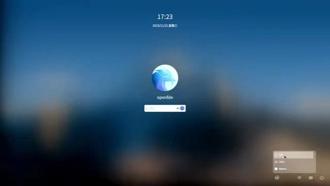
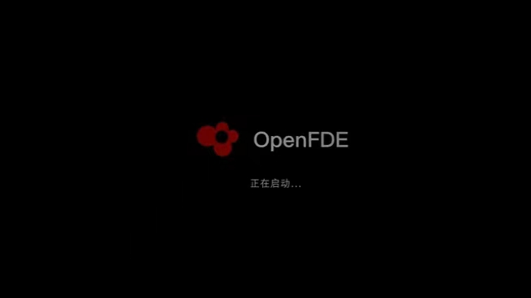

# Quick Start

OpenFDE(Open Fusion Desktop Environment) is a cool Linux open-source desktop environment. It allows you to run Android software on Linux systems and enjoy Linux applications on Android systems.

Now let me guide you on an easy and enjoyable exploration of OpenFDE! This guide will quickly introduce you to OpenFDE and help you experience its charm in both work and leisure. It's a simple and fun process! Are you ready?

<video width="720" height="405" controls>
    <source src="/img/install-guide.mp4" type="video/mp4" />
</video>

For more detailed information on installation and usage, you can continue reading the text version below.

## 1. Installation Preparation{#preparation-before-install}

Before starting the installation of OpenFDE, you need to check if your computer whether meets the following system requirements.

**Hardware:**
- Processor：Phytium D2000、FT2000/4
  
> **Attention:** Currently, we have conducted research, development, and adaptation for the two CPU models mentioned within the Phytium ecosystem. We also welcome everyone to conduct their own research and exploration, enabling OpenFDE to be compatible with a broader range of CPU types! You can proceed to [Build and Development](./../developer/Quick-Start) to start your exploration and research.

- Graphics Card：AMD Radeon、Phytium X100

> **Attention:** If your laptop with an x100 graphics card has **a kernel version lower than 5.4.18-85**, you need to upgrade your kernel before installing and running OpenFDE. Here are the steps to upgrade your kernel:

```
echo deb http://archive.kylinos.cn/kylin/KYLIN-ALL 10.1-2303-updates main restricted universe multiverse | sudo tee /etc/apt/sources.list.d/v10sp12303.list
sudo apt-get update -y
sudo apt-get full-upgrade -y
sudo apt-get autoremove -y 
sudo apt-get autoclean -y && reboot  
```
you must reboot your computer and wait for the new kernel to take effect before proceeding with further operation

>**If you already have OpenFDE installed on your X100 laptop**：After upgrading the kernel and before installing OpenFDE, it's recommended to perform the step ```sudo apt purge fdeion-dkms```
>
> If you are installing OpenFDE for the first time, after upgrading the kernel version, execute the command ```sudo apt install fdeion-dkms``` to install the OpenFDE DKMS source.

- RAM：At least 8GB. If you want to enjoy a smoother experience, I recommend choosing 16GB or more of RAM. 
  
**Software**:
- Operating System：Currently, we have researched and adapted OpenFDE for three operating systems: **Kylin, UOS, and Ubuntu**. However, other Linux operating systems have not been fully adapted and tested yet.

You can also try manually compiling and installing OpenFDE and see if it can be installed on other operating systems. If you have any better ideas, you can join the discussion [here](https://groups.io/g/openfde/topics) and share your feedback! We look forward to hearing from you!

#### <mark>System Setup Requirements(Importantly！！！)</mark>{#system-settings}

In order to install and start OpenFDE smoothly, before you start installing OpenFDE, you need to turn off all security controls on your current system, select 'Settings - Security' in your current system, and go to Security Center.


Using network control as an example, you should disable application internet access control. Additionally, it is recommended to disable controls related to application protection and device security.


## 2. Installation Steps{#installtion-steps}

Let's take the example of Kylin operating system. First, make sure you have opened the terminal of your current system. Execute the following command for a one-click installation:

```
sudo apt-get install curl && curl -fsSL https://openfde.com/getopenfde/get-openfde.sh -o get-openfde.sh && sudo sh ./get-openfde.sh
```

During the installation process, you may be prompted to enter "y" to confirm certain actions. Simply follow the prompts and enter the requested input as necessary. If you want detailed installation instructions, please refer to the [installation guide](./installation-guide#preparation-before-install) provided by the OpenFDE project.

## 3. Get Started{#happy-use}

### 3.1 Login and Logout{#login-and-logout}

#### 3.1.1 Login{#login}

- Accessing the Login Page: After completing the initial installation of OpenFDE, follow these steps to reach the login page:
  - Log out of your current system.
  - Return to the login screen.
  - Select the OpenFDE option: enter your username and password in the designated fields.
  


- Switching to OpenFDE Login System: On the login screen, locate the "OpenFDE" option. You will be prompted to enter your account credentials. And the system will switch to the OpenFDE desktop environment. 
- The account and password for OpenFDE are the same as your current system's account and password.



#### 3.1.2 Logout{#logout}

Clicking on the Start menu, then clicking on the power button icon in the top right corner will bring up three buttons in sequence: Shutdown, Restart, and Logout. Clicking on the Logout button will allow you to exit to the login screen.


### 3.2 Configure Input Method{#config-ime}

OpenFDE comes with the default input method of 'iFlytek Voice Input Method'. To quickly open the iFlytek Voice Input Method, locate it in the Start menu. Selecting the iFlytek Voice Input Method option allows you to enable it and agree to the summary of privacy terms. You can configure input methods, keyboard layouts, and skin fonts according to your preferences.

<mark>A tip: If you encounter a problem similar to the input box in the figure below that covers the text content in the process of using the iFlytek Voice Input Method, you can hover the mouse over the input method prompt word box, and then press and hold the left and right mouse buttons at the same time, so that you can drag the input method prompt word box to other positions.</mark>


### 3.3 Configure Network{#config-network}

OpenFDE can directly utilize external systems such as Kylin, UOS, Ubuntu for networking. Users can click on the OpenFDE icon in the bottom left corner and open Start Menu, Fusion Linux Application to find the Linux Settings. In the Linux Settings, you can configure the network settings for the system.

 

#### 3.3.1 Wired Network Configuration{#config-wired-network}

In the wired network settings, click on Advanced Settings. A pop-up window titled "Ethernet Settings" will appear on the right side.

- Add a New Wired Network: To add a new wired network connection, click on the "+" button located in the bottom left corner.
- Configure an Existing Wired Network: select the desired wired network connection, then click on the Settings button located in the bottom left corner. This will open a window where you can modify the configuration of the current network connection.


#### 3.3.2 Wireless Network Configuration{#config-wlan}

In the wireless network settings, click on Advanced Settings. A pop-up window titled "Wireless LAN Settings" will appear on the right side.

- Add a New Wireless Network: To add a new wireless network connection, click on the "+" button located in the bottom left corner.
- Configure an Existing Wireless Network: select the desired wireless network connection, then click on the Settings button located in the bottom left corner. This will open a window where you can modify the configuration of the current network connection.


#### 3.3.3 VPN Configuration{#config-vpn}

OpenFDE supports interoperability between Android and Linux systems for VPN connectivity, which is a major benefit for remote workers. Taking the popular VPN software EasyConnect as an example, you can directly download the Android version of EasyConnect from the app store or a browser on your Android device.

Once installed, configure the connection to your work VPN. The key point is that there is no need to configure the VPN on the Linux side. You can immediately start your remote work.

### 3.4 Install Application{#install-app}

#### 3.4.1 Install Android Application{#install-android-app}

There are two ways to install Android applications:

- OpenFDE comes with the built-in Via browser. To open Via browser, locate it in the Start Menu and launch it. You can directly search for the application package you want to install using the browser.

- Using the built-in Via browser, you can install Android app marketplaces like "AppGallery" and then proceed to install various Android applications from within the app marketplace.

#### 3.4.2 Install Linux Application{#install-linux-app}

OpenFDE integrates Linux applications into the Android system and provides a built-in standalone Linux Fusion Application window. To open the Linux Fusion Application window, click on the penguin icon labeled "Fusion Linux Application" in the Start Menu. The Linux Fusion Application window operates similarly to a regular Linux graphical system, allowing you to run Linux GUI, command-line interfaces, and more. The usage is identical to a typical Linux environment, and further elaboration is unnecessary.

### 3.5 Operational Tips{#use-skills}

Different from the typical PC desktop's keyboard and mouse operation, OpenFDE has its own unique features. Here are some basic operation tips.

#### Open Application by Single Click{#open-app}

- Installed applications are typically displayed on the desktop with their respective app icons. To quickly open an application, you simply need to **single-click the app icon** on the desktop.
- You can also find the desired application in the application list within the Start Menu. Similarly, you only need to **single-click** to open the application.

#### Open Application Shortcut by Right-Clicking{#right-click}

- When you place your mouse cursor over the target application icon on the desktop, right-clicking will display options such as "Open" and "Remove."
  - Clicking on "Open" will quickly launch the application.
  - Clicking on "Remove" will remove the shortcut of the application from the desktop.
- You can also place your mouse cursor over the target application icon in the application list within the Start Menu. Right-clicking will display options such as "Open," "Pin to Start," and "Uninstall."
  - Clicking on "Open" will quickly launch the application.
  - Clicking on "Pin to Start" will add a shortcut of the application to the Start Menu.
  - Clicking on "Uninstall" will directly uninstall the application.

#### Drag and Drop Icons{#drag-icon}

If you want to drag the desktop application icons or widgets, first, you need to place your mouse cursor over the target application or widget, then **long-press** it, and finally, start dragging the icon to the desired location.

## 4. Learn More{#learn-more}

You can continue using OpenFDE to assist you with work and entertainment! For more detailed usage instructions, please refer to the [User Manual](./user-manual)。
