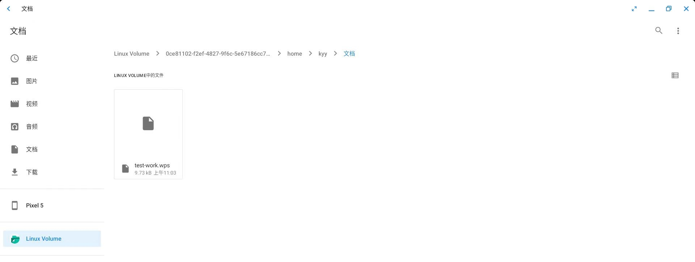
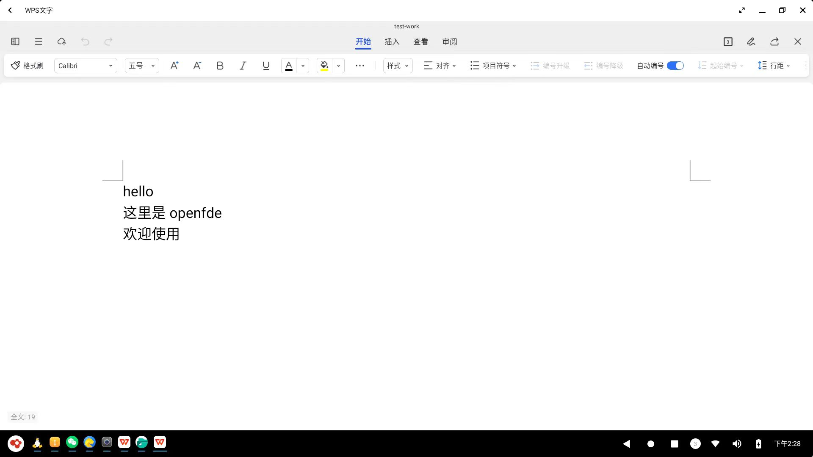

# Expore OpenFDE File System{#file-system}

If you already have some knowledge about OpenFDE, you probably know that it can run Android applications and Linux applications, and its distinctive feature is the integration of file systems. You must be curious about where the files in OpenFDE should be placed and how application data and files are organized.

Now, let's delve into the file system of OpenFDE in detail.

### Overview{#rules}

OpenFDE integrates the Linux file system with the Android file system, enabling mutual access between the two file systems.

### Android File Management{#android-file}

You can open the "Files" application from the start menu to access the intuitive file management interface. Clicking on the maximize button allows you to easily browse and operate files.


The Android file manager displays files and folders using icon and grid views, and you can also choose to switch to the list view. On the left side of the file management interface, there is a series of subfolders: Images, Videos, Audio, Documents, and Downloads. In OpenFDE, downloaded data, images, and videos are saved in their respective folders.


### Access Linux Volumes from Android{#android-access-linux}

In the directory tree on the left side of the file management interface, you can see "Linux Volume," which allows you to access the partitions of the Linux file system.

OpenFDE mounts the Linux file system **by volume** to the Android file system. The Linux volumes are displayed as folders under the "Linux Volume" interface, with each folder named after the UUID of the corresponding volume. In the example below, there is only one partition in the Linux file system, so you can see only one folder.


By clicking on the desired volume, you can access the Linux file system and view common directories within it.


**/HOME/openfde**

An important directory to highlight here is the HOME directory. Under the Linux Volume, within the HOME directory, there is a folder named "openfde." This directory serves as the mount point for the Android file system within the Linux file system, facilitating access to Android's internal files by Linux applications.


You can also directly see the "openfde" directory within your Kirin system. For example, when you switch to the Kylin system and open the file system, it will be visible.


**Note: Do not store files in HOME/openfde when OpenFDE is not running**. This will prevent OpenFDE from mounting the Android directory to the openfde directory upon startup. Because, under the default fuse parameters, the presence of files in that directory will prevent the mounting process.

- If you need to copy files into the Android directory, you can copy them to HOME/.local/share/openfde/Download. Please note that **you need to use sudo** when copying files.

> Furthermore, if you find that the openfde directory fails to mount, meaning there is no openfde directory under /HOME/, you can try executing the following command manually in the terminal.
> 
```
fde_fs -m 
```

### Opening files from Linux in the Android WPS app{#android-open-linux}

Files in Linux can be accessed through the Android file manager and opened using Android applications, such as WPS. Let's take an example of opening a document using WPS.

Open the Android file manager from the start menu and navigate to the test-work.wps file located in the /home/kyy/Documents/ directory under the Linux Volume.



After double-clicking the test-work.wps file, if it's your first time using the Android file manager in OpenFDE, a prompt will appear, giving you the option to choose between opening the file with WPS or the App Store. You can select "Just Once" or "Always" to open the file with the chosen application.



### Linux File System{#linux-file-system}

To open the "Start Menu - Fusion Linux Application" in OpenFDE, locate "Pony" in the Linux application list and click to open the Linux file system manager.


- On the left side, under "Computer - File System," you can see some common folders in Linux.
  


- On the left side, "Computer - openfde (fde_fs)" represents the mounted Android file system.
  


**Access Android files from Linux**

You can access the Android file system from the two main folders in the Linux file system mentioned above in two ways.

- Directly opening: Simply click on the left side "Computer - openfde (fde_fs)" to open the Android file system and click on specific folders to access them.
- Indirect opening: Click on "Computer - File System" to access the /home/username/openfde directory, which will take you to the Android file system.

### File Transfer{#transfer-file}

**Prerequisite:** Open the Linux file management system Pony and perform file transfer operations within Pony.

**Copying files or folders from Linux to the Android file system**

Navigate to your home directory in Linux and copy the required file from the Linux path to the Android path (openfde). For example, copy a file from /home/kyy/Documents/ to /home/kyy/openfde/Download directory.

- use the "cp" command


- You can also use mouse operations: Right-click on the file in /home/kyy/Documents/ and select "Copy." Then, right-click on an empty space in /home/kyy/openfde/Download/ and select "Paste."

**Copying Android files to the Linux file system**

Similarly, navigate to your Android directory at /home/kyy/openfde/ and copy a file from /home/kyy/openfde/Download directory to the Linux /home/kyy/Downloads/ directory.

- use the "cp" command
  


- You can also use mouse operations to copy and paste: Right-click on the file in /home/kyy/openfde/Download/ and select "Copy," then right-click on an empty space in Linux's /home/kyy/Downloads/ directory and choose "Paste."

### Modify and Delete Files{##edit-or-delete}

If you need to edit, modify, or delete existing files or folders, please make sure to perform these operations in the **original file system**.

- Modify files
  
In simple terms, if you copy a file A from the Linux file system to the Android file system, and you need to edit or modify file A, please perform the operation in the Linux file system. **Do not modify the copied file A in the Android file system**. The same operation restrictions apply when copying files and folders from the Android file system to the Linux file system.

- Delete files

Similarly, to ensure file consistency, if you want to delete files or folders, please perform the deletion operation in the respective file system's file manager. In other words, <mark>in the Linux file manager Peony, it is not possible to delete any files or folders in the Android file system "openfde" (fde_fs), and in the Android file system's "Files" application, it is also not possible to delete any files or folders in the Linux Volume.</mark>