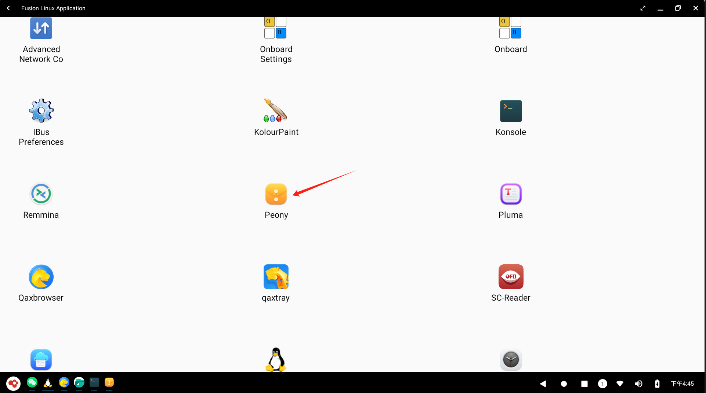

# 探秘OpenFDE文件系统

## 写在前面

&emsp;&emsp;如果你对OpenFDE已经有一定的了解，你大概已经知道在OpenFDE里可以运行安卓系统，也可以运行Linux应用，OpenFDE的特色功能就是文件系统融合。你肯定会好奇OpenFDE的文件到底应该放在哪一端？应用数据和文件到底如何组织呢？

&emsp;&emsp;下面，我们来详细聊聊OpenFDE的文件系统。

### 总的原则

&emsp;&emsp;OpenFDE将Linux文件系统和Android的文件系统进行融合，两者之间文件系统可以互相访问。

### Android文件管理

&emsp;&emsp;在OpenFDE开始菜单打开"文件"，可以直观地看到文件管理界面，点开最大化按钮，以方便你可以更轻松地浏览和操作文件。


&emsp;&emsp;安卓文件管理器以图标和网格视图来展示文件和文件夹，你也可以选择切换成列表视图。文件管理界面左侧的包含一系列子文件夹：图片、视频、音频、文档和下载。在OpenFDE中下载的数据、图片、视频都会保存在对应的文件夹中。


### 挂载Linux卷

&emsp;&emsp;在文件管理界面左侧目录树中可以看到"Linux Volume"，Linux Volume可以看到Linux文件系统的分区。

&emsp;&emsp;OpenFDE将**Linux文件系统按卷挂载到Android文件系统**，Linux卷以文件夹的形式显示在"Linux Volume"界面下，其中文件夹的名字为当前卷的uuid。在下图示例中，Linux文件系统只有一个区，所以可以看到的只有一个文件夹。


&emsp;&emsp;点击目标卷，即可进入Liux的文件系统，可以看到Linux文件系统常见的一些文件目录。


**/HOME/openfde目录**

&emsp;&emsp;重点这里介绍一下home目录，在Linux Volume卷下的home目录下，有个openfde目录，该目录为Android文件系统在linux文件系统处的挂载目录。


&emsp;&emsp;该openfde也可以直接在你的麒麟系统中直接看到，例如当你切换到麒麟系统时，打开文件系统。


&emsp;&emsp;**注意：在未启动OpenFDE的情况下**，不要往HOME/openfde下存放文件。这样会导致OpenFDE启动时，无法将Android目录挂载到该openfde目录。因为目前在fuse默认参数下，针对该目录有文件的情况是不会挂载的。

- 如果一定要拷贝文件进Android目录，可以拷贝到HOME/.local/share/openfde/Download下，**拷贝时需要使用sudo**

> 如果发现openfde目录挂载失败，即/HOME/目录下没有openfde目录，可以尝试手动在终端执行以下命令：
```
fde_fs -m 
```

### Linux文件系统

&emsp;&emsp;在OpenFDE中打开"开始菜单-Fusion Linux Application",在Linux应用列表中找到"Pony",点击打开linux文件系统管理器。



- 左侧"计算机-文件系统"中可以看到linux常见的一些文件夹。
  


- 左侧"计算机-openfde(fde_fs)表示挂载的Android文件系统。
  


**从Linux文件系统访问Android的文件**

&emsp;&emsp;可以上述的两个Linux文件系统主文件夹中访问Android的文件系统,两种方式：

- 直接打开：直接点击左侧"计算机-openfde(fde_fs)"即可打开android的文件系统，点击具体的文件夹进行访问。
- 间接打开：点击"计算机-文件系统", 访问/home/用户名/openfde目录，即可进入android文件系统。

### 文件传输

**前提：**打开Linux的文件管理系统Pony,在Pony下进行文件的传输操作。

**将Linux的文件或文件夹拷贝到Android文件系统下**

&emsp;&emsp;进入你的linux的home目录下，将所需要拷贝的文件从linux路径拷到安卓路径(openfde)下，例如从/home/kyy/文档/路径下拷贝一个文件到/home/kyy/openfde/Download目录下：

- 直接使用cp命令


- 也可以使用鼠标操作：在/home/kyy/文档/下选中文件邮件，点击复制；到/home/kyy/openfde/Download/空白处右键鼠标点击复制。

**将Android文件拷贝到Linux文件系统下**

&emsp;&emsp;同理，进入你的安卓目录/home/kyy/openfde/,将一个文件从/home/kyy/openfde/Download目录拷贝到linux的/home/kyy/下载/目录下：

- 使用cp命令直接拷贝
  


- 也可以通过鼠标操作进行拷贝复制