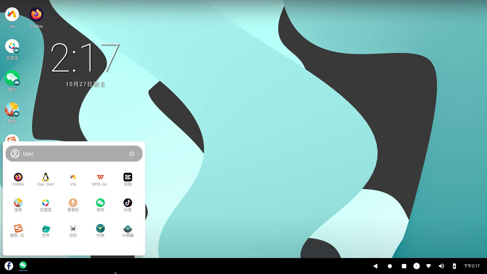
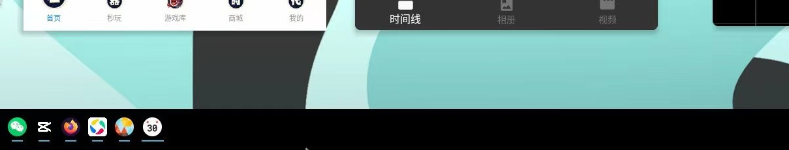
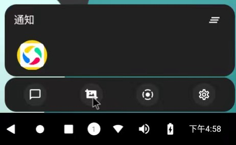
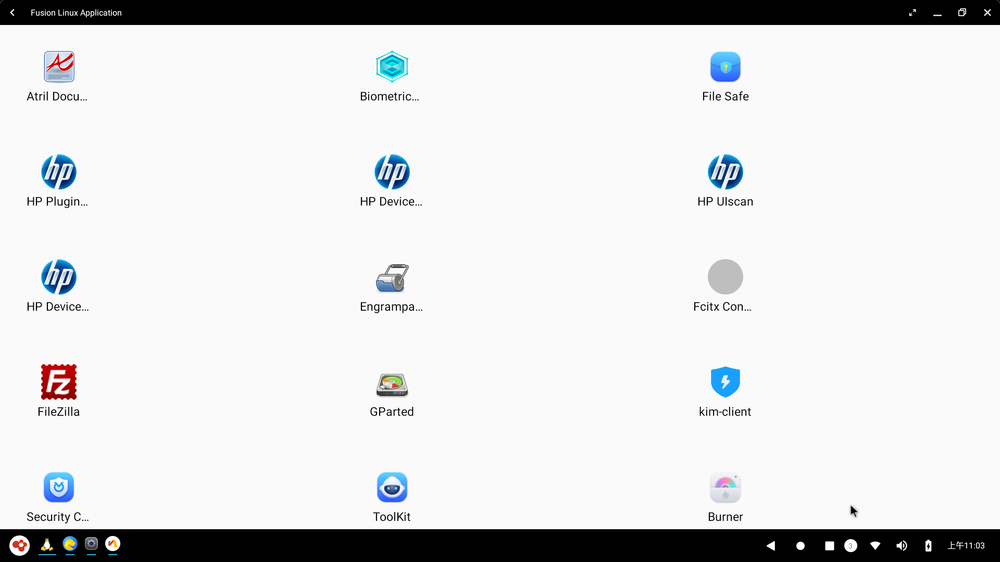
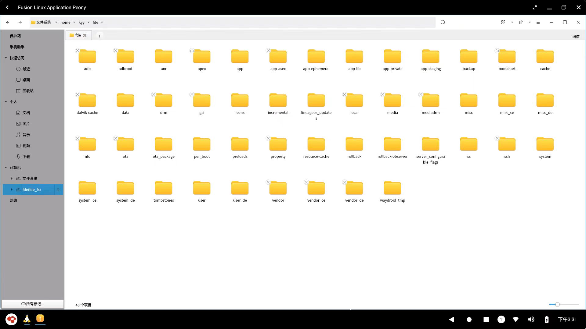
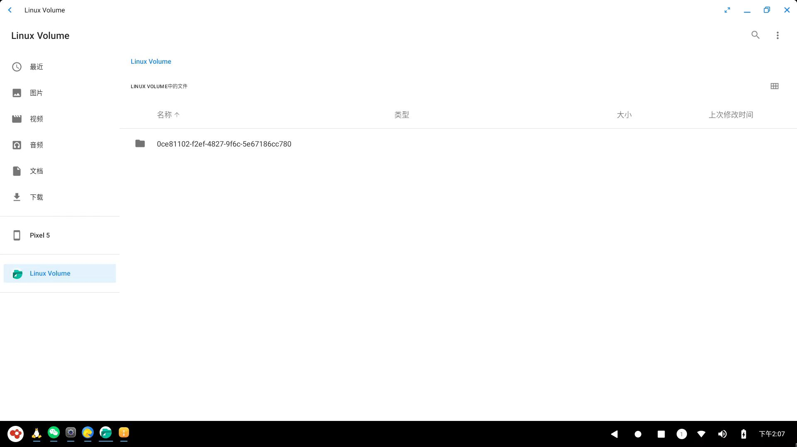

# 用户手册

## 1. 概述

&emsp;&emsp;OpenFDE(Open Fusion Desktop Environment)是一款全新的Linux&安卓融合开源桌面环境，通过将AOSP统一的图形与API设计对接在Linux系统基础上。OpenFDE特点：

- 可原生运行Android和Linux各类应用
- 可在桌面环境使用鼠标操作Android应用
- 开发者 + 统一API
- Android和Linux网络共用
- 以文件融合的方式兼顾Android文件访问的高效性和Linux文件访问的安全性
- 提供Android开发环境和平台，开发者可直接在OpenFDE上进行移动应用开发

&emsp;&emsp;OpenFDE下载和安装指南可参见 [安装指南](./installation-guide) <!-- 注意这里文档链接不要加md后缀 -->

## 2. 自定义功能

### 2.1 开始菜单

&emsp;&emsp;在OpenFDE桌面左下角点击OpenFDE图标，打开应用菜单，显示已安装的应用列表，包括系统自带应用（图库、文件、日历、时钟等） 和已安装的第三方应用。

 

- 应用菜单支持搜索应用，用户在搜索栏中输入应用名，可快速找到和打开目标应。 
- 应用菜单支持将应用以快捷方式添加到桌面。

### 2.2 任务栏

&emsp;&emsp;任务栏位于桌面的屏幕底部，用于快速启动应用程序，支持单机图标、鼠标右键或者拖动应用。

&emsp;&emsp;任务栏显示当前正在打开的应用；也可以应用图标固定在任务栏，用于快捷启动应用。

### 2.3 状态栏

&emsp;&emsp;状态栏显示系统当前状态，位于屏幕底部的右下方，主要显示的系统状态有：

- 网络状态
- 蓝牙状态
- 声音状态
- 当前时间

&emsp;&emsp;状态栏还包括以下功能按钮：

- 后退按钮：点击后退按钮可以返回到应用程序上一步
- 最近使用应用按钮：显示最近使用过的应用
- 显示桌面按钮：点击后直接显示桌面

&emsp;&emsp;状态栏还包括通知中心和快捷方式，显示当前系统的消息通知，包括应用通知消息和系统通知消息。点击状态栏的大圆圈按钮(带数字图标)，即可弹出消息中心与快捷方式的弹窗，从左至右图标依次表示以下功能：

- 消息中心：展示具体的消息通知内容
- 快捷截图: 点击可直接进行截图操作，支持对截取的图片进行编辑。
- 快捷录屏: 点击可弹出录屏弹窗，确认"开始"后即可进行屏幕的视频录制。
- 快捷设置: 点击跳转到设置中心，可以快速打开系统设置。

### 2.4 网络

&emsp;&emsp;OpenFDE支持Linux网络和Android系统网络互通，Linux和Android可以共享有限网络、VPN等设置。

- 有线网络设置：用户在Linux系统中插入网线，配置IPV4和DNS信息后，在安卓系统中无需再连接WLAN。
- VPN设置：用户只需在Linux或Android其中一端配置VPN信息，即可在另一端系统中直接使用该VPN。

### 2.5 输入法

&emsp;&emsp;OpenFDE支持内置输入法讯飞输入法，用户可在设置-系统-语言和输入法中添加新的语言、输入法和键盘。

## 3. 软件应用

### 3.1 应用安装

&emsp;&emsp;OpenFDE的软件应用安装包括系统预安装和网络下载安装两种方式。

- OpenFDE会预先在安装系统通用的软件应用，包括图库、录音机、文件、日历、时钟、计算器、音乐、讯飞输入法、via浏览器。用户安装完OpenFDE环境后即可直接使用上述应用。

- 网络下载安装方式：用户可以通过via浏览器在线下载各种软件应用的安装包，也可以在via浏览器下载安装安卓应用市场如应用宝，再从应用宝中安装各种安卓应用。

### 3.2 应用快捷方式

&emsp;&emsp;OpenFDE支持多种方法添加应用快捷方式。

- 软件应用在安装完成时会自动添加快捷方式图标到桌面，鼠标长按桌面的快捷方式图标可以选择"打开"应用或者选择"移除"应用快捷方式。
  
- 已经安装的软件应用还会在"开始菜单"里自动添加快捷方式，用户可以在"开始菜单"中点击应用图标快速打开软件应用。

### 3.3 应用全屏

&emsp;&emsp;对于已经打开的应用，OpenFDE支持标准显示、最大化、最小化和全屏显示。

## 4. Linux融合应用

### 4.1 概述

&emsp;&emsp;OpenFDE基于标准Linux系统基础环境，支持Linux原生应用在安卓系统上运行，包括但不限于已有的Linux GUI、命令行应用。

### 4.2 Linux应用列表

&emsp;&emsp;在"开始菜单"点击企鹅图标"Fusion Linux Application"即可打开Linux融合应用的独立窗口(以下称为"linux融合桌面")。在linux融合桌面中显示linux应用列表，支持MATE Terminal、Tabby等应用运行Linux GUI终端。

&emsp;&emsp;用户可以在Linux终端应用中使用终端命令安装linux应用，应用安装成功后会直接在linux融合桌面的应用列表中显示。

## 5. 文件系统融合

&emsp;&emsp;OpenFDE将安卓和Linux的文件系统融合互通，两者之间文件系统可以互相访问。

**(1) 在linux文件系统下访问android的文件**

&emsp;&emsp;打开Linux融合桌面，在应用列表中找到"Peony"，点击打开linux文件系统管理器

其中有两种方式可以访问android的文件系统：

- 直接打开：直接点击左侧"计算机-fde"即可打开android的文件系统，点击具体的文件夹进行访问。
- 间接打开：点击/home/用户名/fde目录，即可进入android文件系统。**注意**：这里fde目录为当前用户下系统自带的目录，如果用户自己创建的同名fde目录，则无法访问android文件系统。

**(2) 在android文件系统下访问linux的文件**

&emsp;&emsp;打开"开始菜单"，选择"文件"打开应用，即可打开android文件管理器。点击左侧工具栏"Linux Volume"访问linux系统的文件。

## 6. 开发者工具

&emsp;&emsp;在OpenFDE平台上，Android应用开发者在使用android studio进行开发时，可以不再需要android virtual device。用户只需要在android studio中选择设备"Google Pixel5",即可直接连接OpenFDE，实现一边开发安卓应用，同步在OpenFDE中进行调试。

