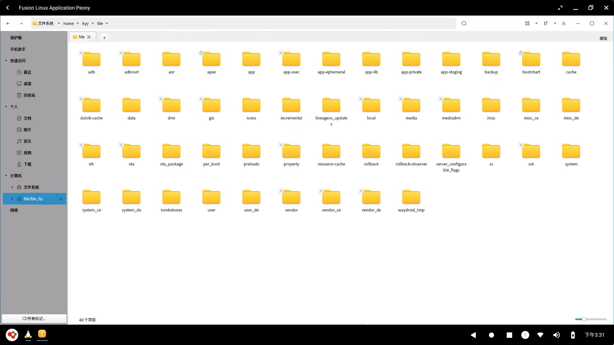
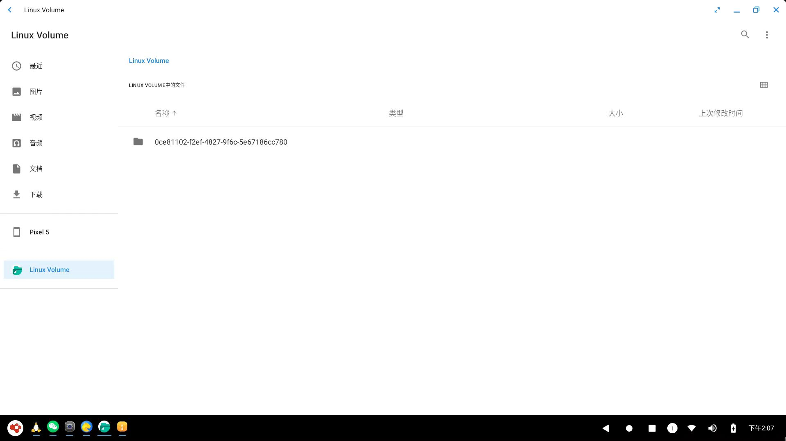

# User Manual{#user-manual}

## Overview{#summary}

Openfde(Open Fusion Desktop Enviroment) is a new open-source desktop environment that combines Linux and Android by integrating the unified graphics and API design of AOSP into the Linux system foundation.

OpenFDE features the following characteristics:

- It can natively run various types of Android and Linux applications.
- You can use mouse input to interact with Android applications in the desktop environment.
- Developer and Unified API.
- Shared networking between Android and Linux.
- Efficiently combining Android file access and Linux file access in a unified manner that prioritizes both efficiency and security.
- OpenFDE provides an Android development environment and platform, allowing developers to directly perform mobile application development on OpenFDE.

For instructions on downloading and installing OpenFDE, please refer to the [Installation Guide](./installation-guide).

## 1. Customizable Features{#definition-function}

### 1.1 Start Menu{#start-menu}

Click on the OpenFDE icon in the bottom-left corner of the desktop and open the application menu. There will display a list of installed applications, including system default apps (Gallery, File Manager, Calendar, Clock, etc.) and installed third-party applications.

 

- The application menu supports app search, allowing users to quickly find and open the desired application by entering its name in the search bar.
- The application menu supports adding applications to the desktop as shortcuts.

### 1.2 Taskbar{#taskbar}

The taskbar is located at the bottom of the desktop screen and is used for quickly launching applications. It supports single-clicking on icons, right-clicking with the mouse, or dragging applications.

The taskbar displays the currently open applications. Additionally, application icons can be pinned to the taskbar for quick access and launching.

### 1.3 Status Bar{#status-bar}

The status bar displays the current system status and is located at the bottom-right of the screen. It primarily shows the following system statuses:

- network status
- bluetooth status
- voice status
- current time

The status bar also includes the following functional buttons:

- Back button: Clicking the back button allows you to return to the previous step of an application.
- Recent apps button: Displays recently used applications.
- Show desktop button: Clicking this button directly displays the desktop.

The status bar also includes the notification center and quick settings, which display current system notifications, including app notifications and system notifications. Clicking the large circle button on the status bar (with a number icon) will pop up the notification center and quick settings panel. The icons from left to right represent the following functions:

- Notification Center: Displays detailed notification content.
- Screenshot: Clicking it allows you to directly take a screenshot, and it supports editing the captured image.
- Screen recording: Clicking it will bring up a screen recording popup, and after confirming "Start," you can begin recording your screen.
- Quick settings: Clicking it will navigate to the Settings menu, allowing you to quickly access system settings.

### 1.4 Network{#network}

OpenFDE supports network interoperability between Linux and Android systems, allowing them to share network configurations such as limited networks, VPNs, and more.

- Wired network settings: When a user connects an Ethernet cable to their Linux system and configures the IPv4 and DNS information, there is no need to connect to WLAN again in the Android system.
- VPN settings: Users only need to configure the VPN information on either the Linux or Android side, and they can directly use that VPN on the other system.

### 1.5 Input Method{#ime}

OpenFDE supports the built-in iFlytek Voice Input Method. Users can add new languages, input methods, and keyboards in the Settings -> System -> Language and Input section.

## 2. Applications{#applications}

### 2.1 Install applications{#install-software}

The application installation includes two methods: system pre-installation and download installation online.

**pre-installed applications**

OpenFDE comes with pre-installed common software applications, including Gallery, Voice Recorder, File Manager, Calendar, Clock, Calculator, Music Player, iFlytek Voice Input Method, and Via Browser. Users can directly use these applications after installing the OpenFDE environment

**download applications online** 

For Android applications, users can utilize the Via Browser to download various software application installation packages online. The downloaded APK installation packages are stored in the Download directory of the Android file system. To begin the installation, simply double-click the APK installation package within the current download directory.

### 2.2 Shortcut{#shorcut}

OpenFDE supports multiple methods for adding application shortcuts.

- Upon installation completion, applications will automatically add shortcut icons to the desktop. By long-pressing the shortcut icon on the desktop with a mouse, you can choose to "Open" the application or select "Remove" to delete the application shortcut.
  
- Indeed, installed applications will also be automatically added to the Start Menu as shortcuts. Users can simply click on the application icon in the Start Menu to quickly open the software application.

### 2.3 Fullscreen{#fullscreen}

For opened applications, OpenFDE supports standard display, maximize, minimize, and fullscreen modes.

## 3. Linux Fusion Application{#linux-fusion}

### 3.1 overview{#linux-summary}

OpenFDE is based on a standard Linux system foundation and supports running native Linux applications on the Android system. This includes, but is not limited to, existing Linux GUI and command-line applications.

### 3.2 Linux Application Lists{#linux-app-list}

Clicking the penguin icon Fusion Linux Application in the Start menu opens a separate window for the Linux Fusion Application. The Linux Fusion Application displays a list of Linux applications, including support for running Linux GUI terminals such as MATE Terminal and Tabby.

Users can use terminal commands in the Linux terminal application to install Linux applications. Once the application is successfully installed, it will directly appear in the application list of the Linux Fusion Desktop.

## 4. File System Fusion{#fusion-file-system}

OpenFDE facilitates the fusion and interoperability of the Android and Linux file systems, allowing seamless access and interaction between the two. This integration enables mutual access to files and folders between the Android and Linux file systems, providing users with the convenience of sharing files and data between both environments.

**(1) access Android files from the Linux file system**

To open the Linux file system manager in the Linux Fusion Desktop, follow these steps:

1. Open the Linux Fusion Desktop by clicking on the penguin icon "Fusion Linux Application" in the Start menu.
2. Locate the application called "Peony" in the application list.
3. Click on "Peony" to open the Linux file system manager.
4. Once Peony opens, you can navigate through the Linux file system, access files and folders, and perform various file management tasks like copying, moving, deleting, and creating directories.

Peony is a Linux file manager that provides a graphical interface to explore and manage files within the Linux environment.

There are two ways to access the Android file system：

- Access Directly: Simply click on "Computer - OpenFDE" on the left side to directly open the Android file system. Click on specific folders to access them.
- Access Indirectly: Click on "Computer - File System" to access the /home/username/openfde, which will take you to the Android file system.
  
**注意**：这里openfde目录为当前用户下系统自带的目录，如果用户自己创建的同名openfde目录，会无法访问android文件系统。

**(2) 在android文件系统下访问linux的文件**

&emsp;&emsp;打开"开始菜单"，选择"文件"打开应用，即可打开android文件管理器。点击左侧工具栏"Linux Volume"访问linux系统的文件。

## 5. 开发者工具{#developer-tools}

&emsp;&emsp;在OpenFDE平台上，Android应用开发者在使用android studio进行开发时，可以不再需要android virtual device。用户只需要在android studio中选择设备"Google Pixel5",即可直接连接OpenFDE，实现一边开发安卓应用，同步在OpenFDE中进行调试。

