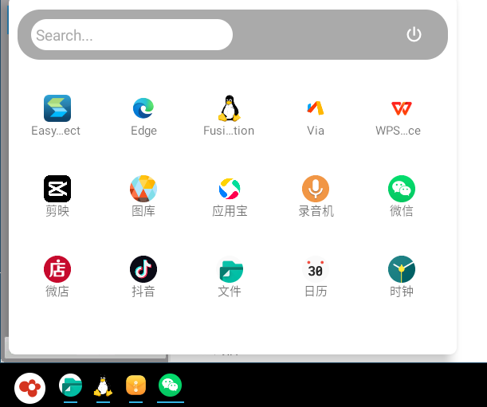
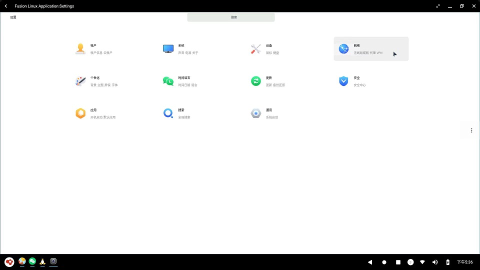

# 快速入门指南

&emsp;&emsp;OpenFDE(Open Fusion Desktop Environment)是一款全新的基于ASOP的Linux开源桌面，支持Linux上运行原生安卓应用，也可以在安卓系统中运行Linux应用。

&emsp;&emsp;本快速入门指南旨在指导用户首次安装OpenFDE，快速上手使用OpenFDE开始办公和娱乐。

## 一、安装准备

在安装OpenFDE之前请先确认您具备以下环境：

**硬件要求:**
- 处理器：飞腾D2000、FT2000/4两种CPU型号
- 显卡：AMD Radeon、Phytium X100
- 内存：最少8GB，推荐16GB及以上

**软件要求**
- 操作系统：支持麒麟、统信、ubuntu

其他Linux 操作系统尚未完全适配和测试，可以尝试手动编译安装，遇到问题请反馈至[这里](https://gitee.com/organizations/openfde/issues)。

## 二、配置安装源和证书

以麒麟操作系统为例，进入您当前系统的终端界面，依次执行以下步骤：

```
sudo apt-get install wget gpg

sudo install -D -o root -g root -m 644 packages.openfde.gpg /etc/apt/keyrings/packages.openfde.gpg

sudo echo \
  "deb [arch="$(dpkg --print-architecture)" signed-by=/etc/apt/keyrings/packages.openfde.gpg] http://openfde.com/repos/kylin/ \
  "$(. /etc/os-release && echo "$PROJECT_CODENAME")" main" | \
  sudo tee /etc/apt/sources.list.d/openfde.list > /dev/null

rm -f packages.openfde.gpg

sudo apt-get update

sudo apt-get install openfde
```

其他更多操作系统安装OpenFDE详细请看[安装指引](./installation-guide)
<!-- 
- 对于ubuntu系统
```
sudo echo \
  "deb [arch="$(dpkg --print-architecture)" signed-by=/etc/apt/keyrings/packages.openfde.gpg] http://openfde.com/repos/ubuntu/ \
  "$(. /etc/os-release && echo "$VERSION_CODENAME")" main" | \
  sudo tee /etc/apt/sources.list.d/openfde.list > /dev/null
```
-->

## 三、快速使用

### 1. 登录

- 进入登录页面：首次安装OpenFDE完成后，注销您的当前系统，进入到登录界面，此时在系统图标处可以看到新增有OpenFDE的选项。
  


- 切换登录系统：点击"FDE"后，既可切换到OpenFDE桌面环境进行登录。OpenFDE的账户和密码与您当前系统的账户密码是一致的。

**注意：** 这里首次选择"FDE"输入密码登录时可能会又跳回当前登录界面，再次输入密码登录即可成功登录进OpenFDE。登录OpenFDE成功后，可以看到OpenFDE的启动画面。


### 2. 配置输入法

OpenFDE内置默认输入法为讯飞输入法，在"开始菜单"中找到"讯飞输入法"，即可快速打开讯飞输入法。选择启用讯飞输入法，同意隐私条款概要，即可自行配置输入键盘、键盘布局和皮肤字体等。

### 3. 配置网络

OpenFDE可以直接使用外部系统(麒麟/统信/ubuntu)等网络，用户可以点击左下角的OpenFDE图标，打开"开始菜单-Linux Fuse Application"，找到Linux的Setting, 在linux设置中配置系统的网络。





### 4. 安装应用

#### 4.1 安装安卓应用

安装安卓应用有两种方式：

- 方式一：OpenFDE内置via浏览器，在“开始菜单”中打开via浏览器，可以直接在浏览器搜索想要安装的应用软件包。
- 方式二：使用方式一安装安卓应用市场如"应用宝"，再从应用宝中安装各种安卓应用。


#### 4.2 安装linux应用

&emsp;&emsp;OpenFDE融合Linux应用到安卓系统中，内置独立的Linux融合应用窗口。在开始菜单点开企鹅图标"Linux Fusion Application"，就可以打开Linux融合应用窗口。Linux融合应用窗口和正常的Linux图形系统使用方式是一样的，可以直接运行Linux GUI、命令行等，这里不再赘述。

## 四、更多了解

你可以继续使用OpenFDE来帮助你办公和娱乐啦！更多详细的使用指导参见[用户手册](./user-guide.md)。