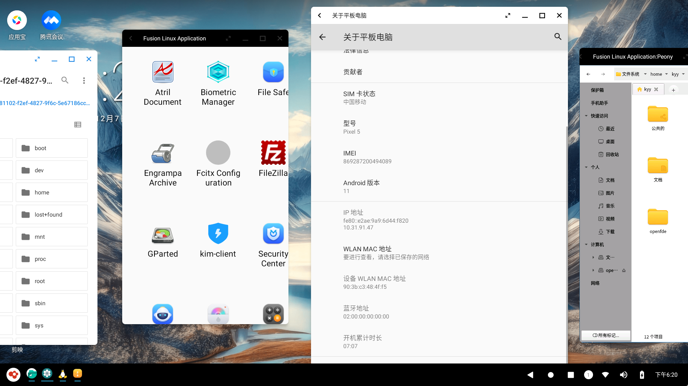
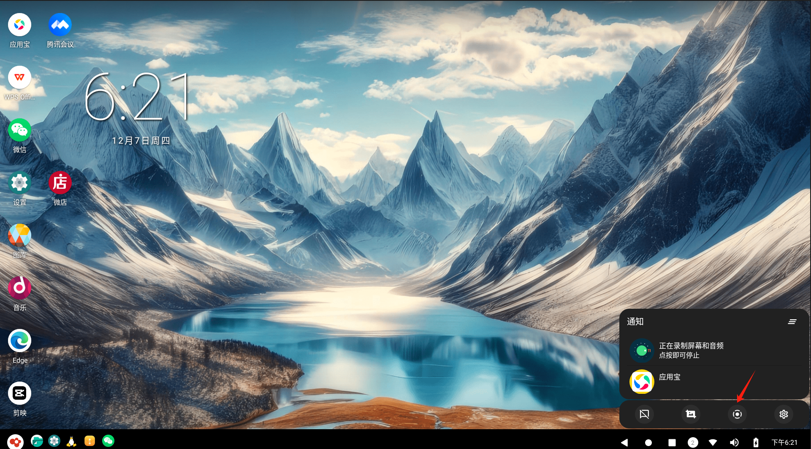
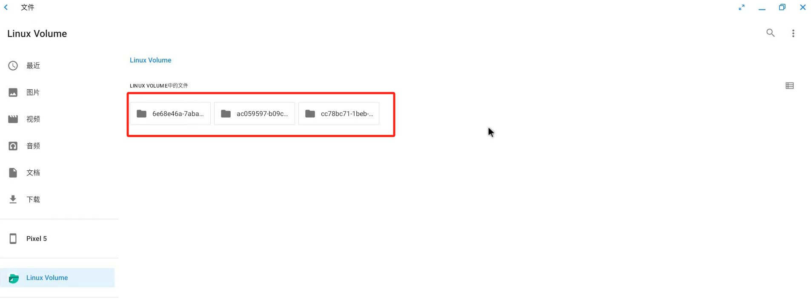
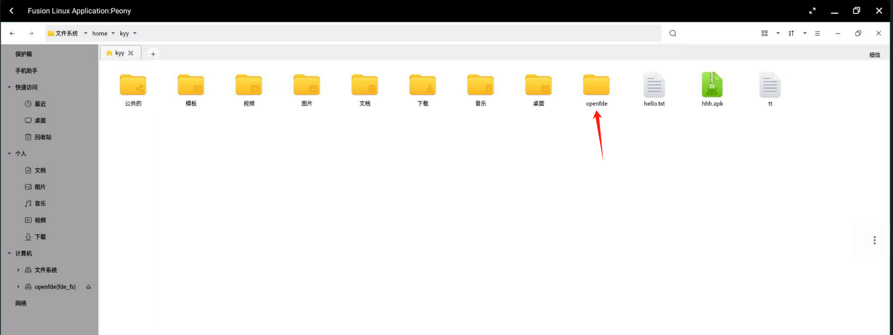

# Version 1.0.3 Changelog

## New Features

### Drag windows beyond the left screen boundary

version-1.0.3 supports window dragging beyond the screen boundary, making the screen layout more flexible. It allow users to freely place windows in different positions on the screen, no longer restricted by screen edges, and achieve a more flexible screen layout.

### Remove the limitations on recording duration and file size

In the quick access shortcuts located in the notification center of the bottom status bar on the desktop, when clicking on the screen recording option, there will no longer be any limitations on the recording duration and file size of the video.

### File system fusion supports mounting logical volumes

In the application list of the Start menu, you can open the Android file manager and click on the "Linux Volume" in the left sidebar to directly access multiple logical volumes in Linux.

### Write permissions for HOME/openfde
  
To open Pony in the Linux fusion application list and support writing Linux files to the HOME/openfde directory, you can use the following steps to copy the "hello.txt" file from **/home/kyy/** to **/home/kyy/openfde/**: (kyy is a username)

1. Open the Linux fusion application list.
2. Locate and open the "Pony" application.
3. Within the Pony application, navigate to the /home/kyy/.
4. Find the "hello.txt" file in the /home/kyy/.
5. Copy the "hello.txt" file.
6. Navigate to the /home/kyy/openfde/.
7. Paste the copied "hello.txt" file into the /home/kyy/openfde/.

## Fixed Problems

- Fix the issue of the Shift key not releasing in the Linux fusion application.
- Fix the issue of lagging during screen recording on Phytium x100. 
- Fix the issue of "too many security failures" when connecting to Linux fusion applications
- After rebooting OpenFDE, it no longer directly enters the OpenFDE desktop but stays at the login screen.
