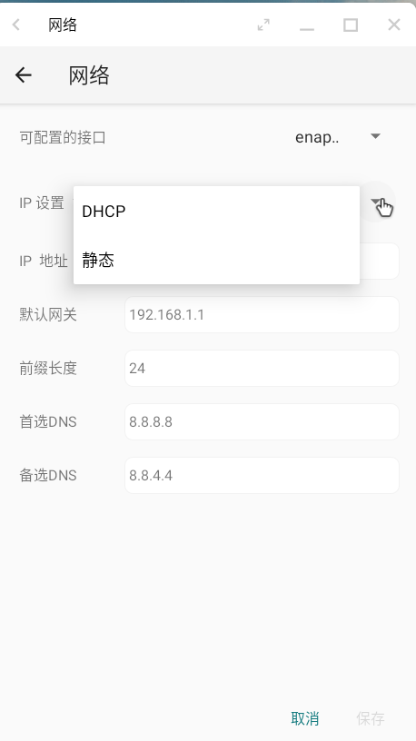
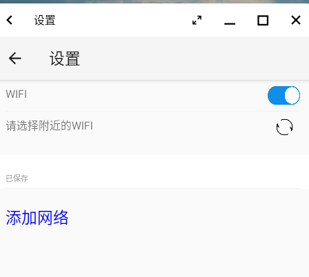
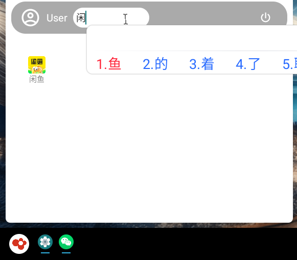
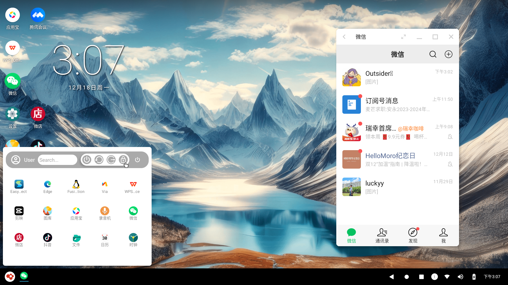
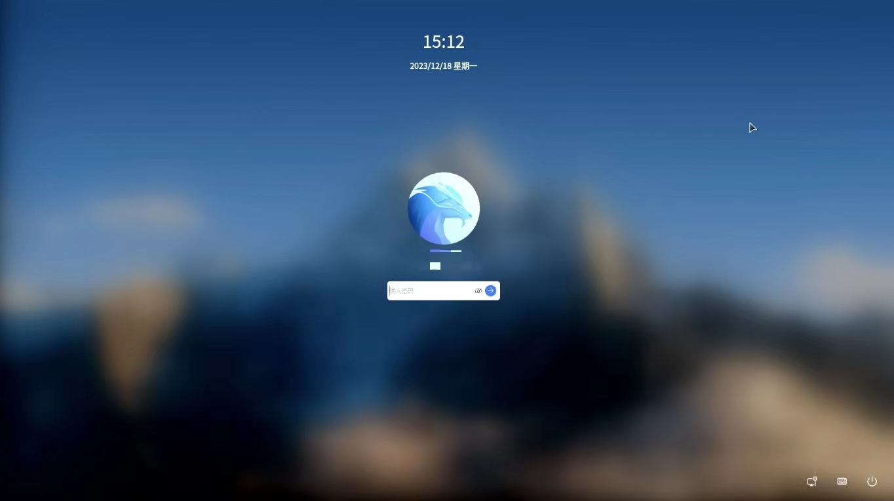
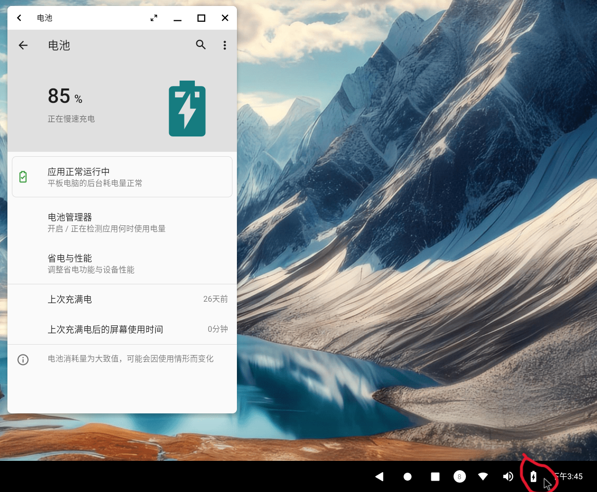

# v1.0.4版本更新内容

## 新增功能

### 增加网络设置功能

&emsp;&emsp;支持在android桌面设置网络，包括**设置linux有线网络和无线WiFi网络**。打开开始菜单-设置-网络，可以看到以太网和WIFI的设置选项。

- **设置以太网**

&emsp;&emsp;默认支持有限网络可配置的接口为enaphyt4i0，你可以默认使用DHCP，也可以切换手动配置静态ip。

> **注意**：当前更新版本只支持对有限网卡的ip进行设置，暂时不能显示在linux网络中已经配置好的ip，我们将在下个版本进行完善。

- **设置WIFI**

&emsp;&emsp;如果你的电脑配置有无线网卡，你可以在这里连接新的WIFI。

&emsp;&emsp;在android设置中配置成功有限网络或无线WIFI后，linux那边的网络会同样生效。

### 支持在开始菜单搜索指定应用

&emsp;&emsp;为方便用户快速找到目标应用，开始菜单新增搜索栏，支持根据应用名称来搜索目标应用。

### 支持OpenFDE锁屏

&emsp;&emsp;打开开始菜单，在右上角的电源按钮图标中新增“锁屏”按钮，点击“锁屏”按钮后可以直接退出到OpenFDE的登录界面，在登录界面登录后可以再次直接快速进入OpenFDE。

### 状态栏增加电源icon跳转到系统->电源设置界面功能

&emsp;&emsp;在屏幕底部的状态栏增加电池icon，点击即可跳转到系统的电源设置。

## 修复问题

- 移除wificond服务，避免循环启动wificond
- 修复融合应用输入法掉字、多字问题
- 修复融合应用剪切板不同步的问题
- 修复打开部分融合应用时报错
- 修复融合应用连接的报错
- 修复双击融合应用时而卡死的问题
- 修复图库分辨率低的问题

