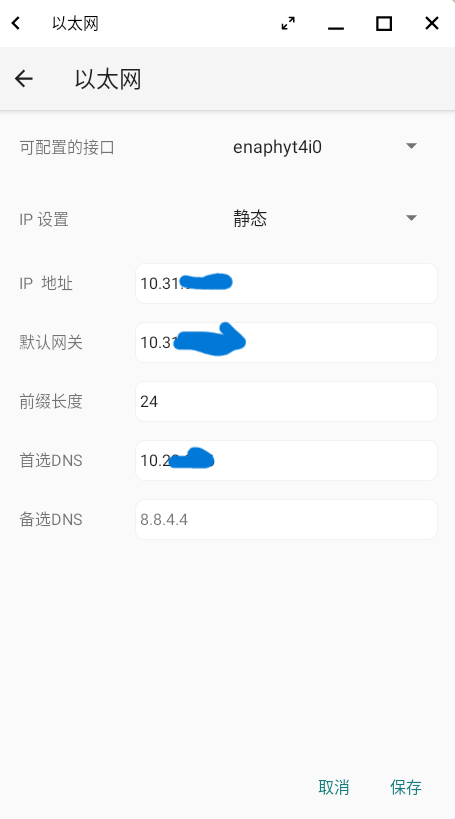

# Version 1.0.5 Changelog

## New Features

This version update does not include any new features.

## Fixed Problems

Fix the issue where LanXin crashes in a rooted environment and cannot run properly.

## Optimization

**Optimization for mouse lag when downloading software from App Store**

Optimized the issue causing mouse lag when opening App Store and downloading software on the Phytium X100 laptop.

**Network settings interface optimization**

On the Android platform, the network settings interface now displays both the static IP address set in Linux and the IP address obtained through DHCP.

**Optimization of wake-up state after application sleep**

Optimized the issue on the Phytium X100 laptop where OpenFDE desktop appeared black upon waking up from sleep when an application was in the foreground. Additionally, added the feature to automatically enter the lock screen interface after waking up.