# Openfde玩转win11应用

&emsp;&emsp;本文档主要介绍如何在OpenFDE下使用Win11，主要过程包括tiny11镜像、使用phyvirt将镜像安装为虚拟机并将操作系统显示语言设置为中文、copy qcow2包并最终尝试在OpenFDE环境中使用虚拟机去实现。下面将介绍详细的环境搭建方式。

### 软硬件资源

#### 硬件

* 16CPU 
* 16GB MEM
* 硬盘40GB
* 内核版本: 5.4.18-85-generic
* aarch64
  
#### 软件

* Kylin V10 SP1
* phyvirt app包：cn.com.vapp_1.5.6.0_arm64_kylin.deb
* tiny11虚拟机qcow2文件：tiny11_20231221_114340.qcow2
* vapp镜像文件:vapp-v1.5.6.0-20231107-1540.iso
    * 安装好vapp后已存在于路径/opt/apps/cn.com.vapp/files/iso/vapp-v1.5.6.0-20231107-1540.iso
* 虚拟机安卓版:android-build-release-signed.apk
    * 安装好vapp后已存在于路径/opt/apps/cn.com.vapp/files/android-build-release-signed.apk
* 远程桌面安卓版:aFreeRDP-release.apk
    * 安装好vapp后已存在于路径/opt/apps/cn.com.vapp/files/aFreeRDP-release.apk

### 安装前提

Openfde已安装完毕并可以正常使用

### 搭建步骤

1. Kylin下双击“cn.com.vapp_1.5.6.0_arm64_kylin.deb”,点击“一键安装”，在弹出的麒麟授权窗口输入pc密码后开始安装
   

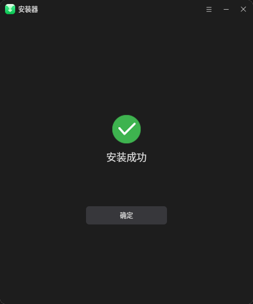

2. 安装完可在应用列表找到“vapp-demo”，点击打开，可在系统设置中看到虚拟机的共享目录默认为“/home/test/桌面/share”
   
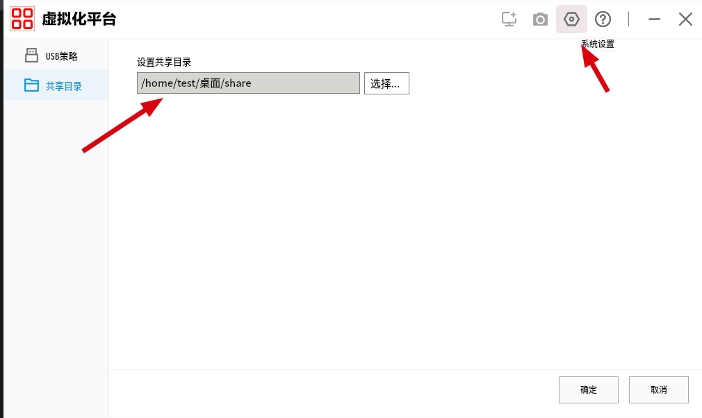

3. 将vapp镜像文件复制到共享目录，用以在虚拟机内部执行
   
```
mkdir -p  ~/桌面/share/vm4 
cp /opt/apps/cn.com.vapp/files/iso/vapp-v1.5.6.0-20231107-1540.iso ~/桌面/share/vm4
```
4. 点击“基于已有镜像创建”，找到已有的tiny11虚拟机qcow2文件，这里我放在了“/mnt/tiny11/”,选中路径下的任意qcow2文件打开
   
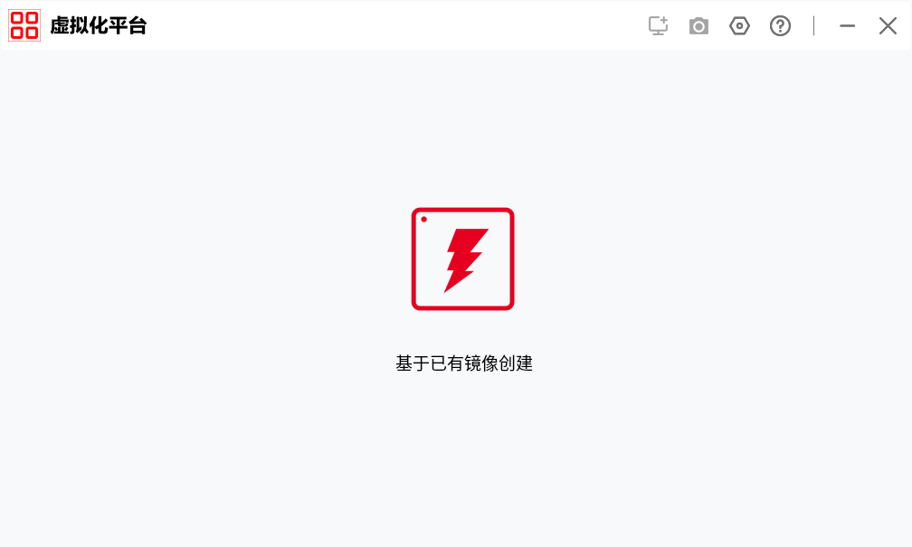
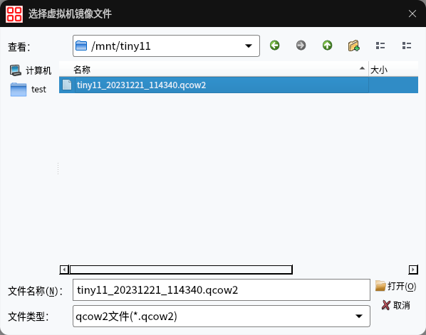

5. 输入虚拟机名，操作系统类型、CPU数量、内存大小等信息，点击右下角确认开始创建虚拟机
   
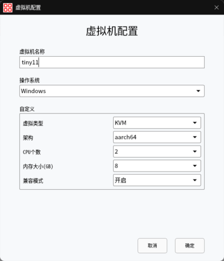

6. 等待虚拟平台右下角状态从“未就绪”变为“就绪”,点击“调试桌面”可打开虚拟机桌面，注意此时所在的用户为虚拟机默认的用户为pvuser（用户和密码都为pvuser）
   
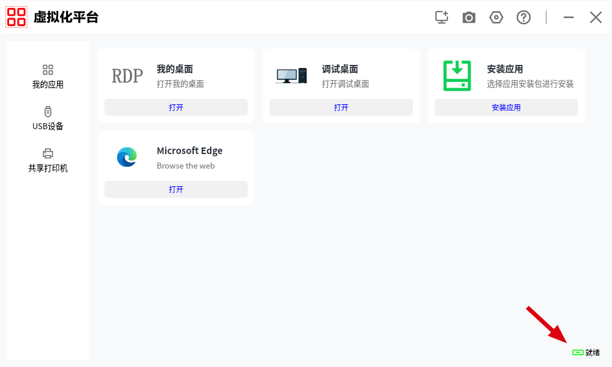
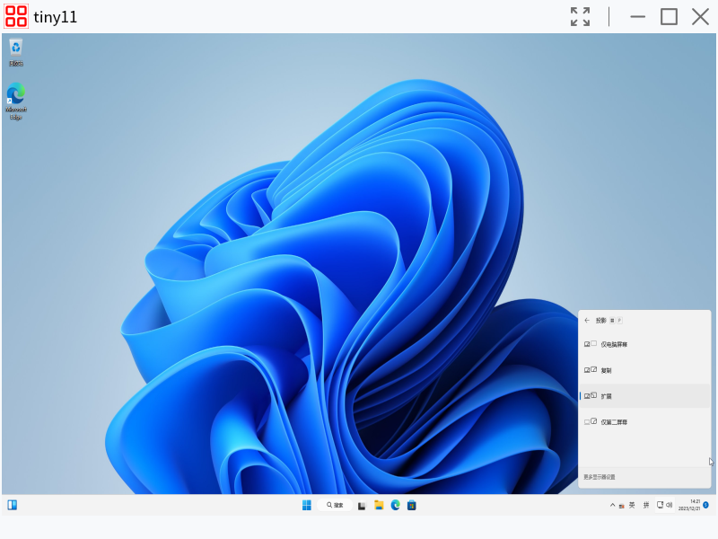

7. 打开共享目录，找到第3步copy进入的vapp镜像文件vapp-v1.5.6.0-20231107-1540.iso，双击打开
   


8. 以管理者身份运行其中的"phyvirt-app-v1.5.5.0-2023117-1536.exe"


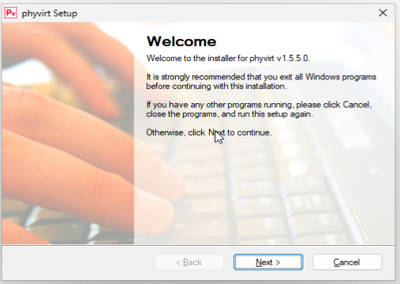
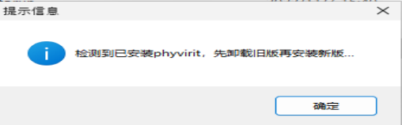
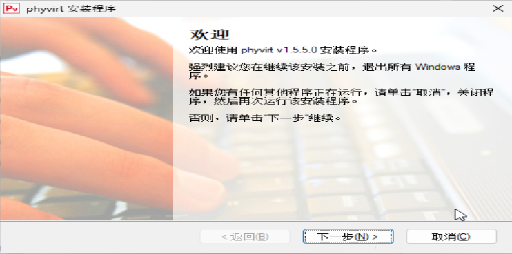
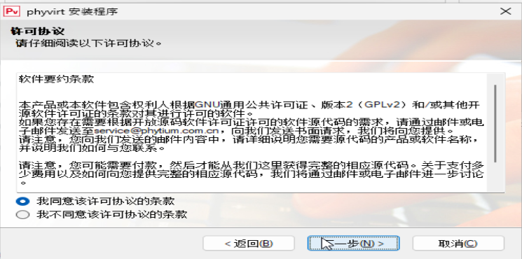

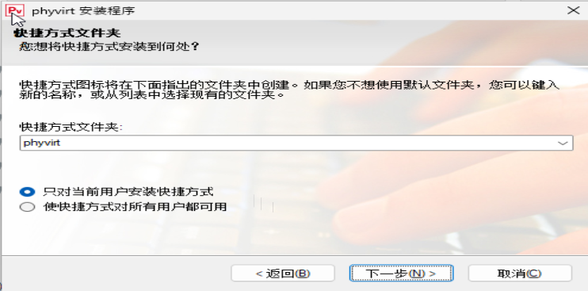
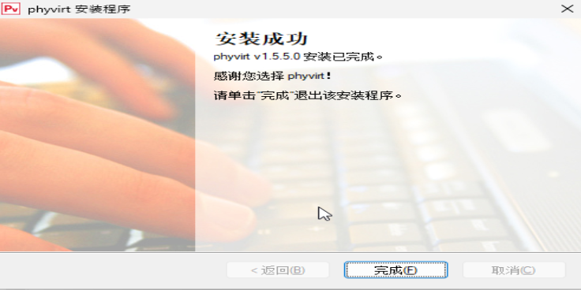

9. 安装完成后需要等待对应的驱动安装结束，会出现是否重启系统的窗口，点击“是”重启系统

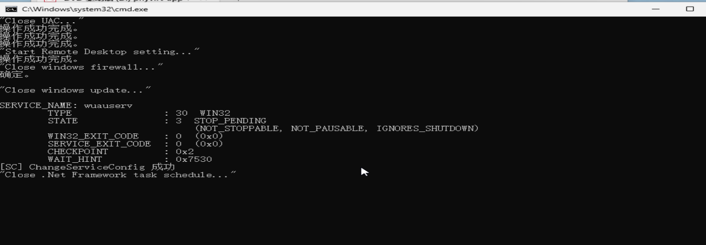


10. 注销kylin桌面，进入openfde桌面，点击开始菜单->Fusion Linux Application,找到linux终端应用Konsole
    
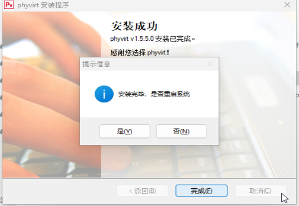


11. 在Konsole中输入以下命令，安装虚拟机安卓版和远程桌面安卓版

```
waydroid app install /opt/apps/cn.com.vapp/files/android-build-release-signed.apk
waydroid app install /opt/apps/cn.com.vapp/files/aFreeRDP-release.apk 
```


12. 点击开始菜单->phyvirt应用,可见有在kylin上新建的虚拟机tiny11

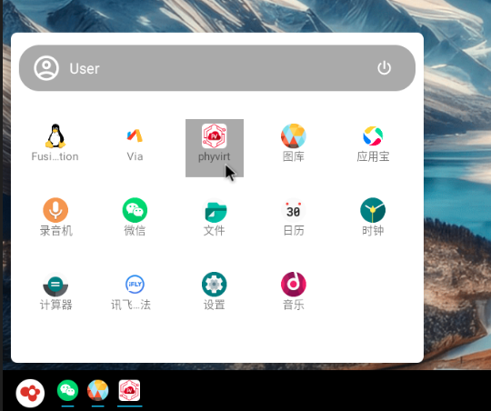

13. 在openfde的phyvirt上启动虚拟机

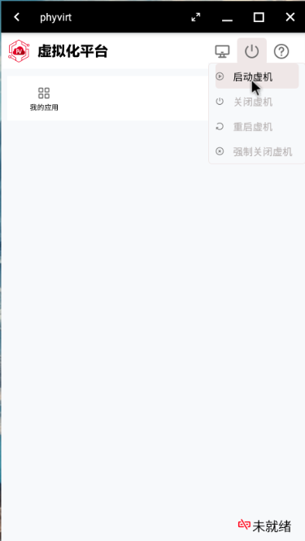

14. 待右下角状态为“就绪”，可点击“我的桌面”进入虚拟机

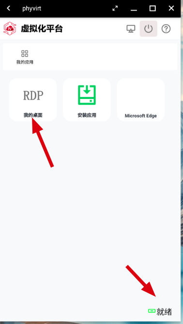

15. 将窗口全屏就可以正常使用了
    
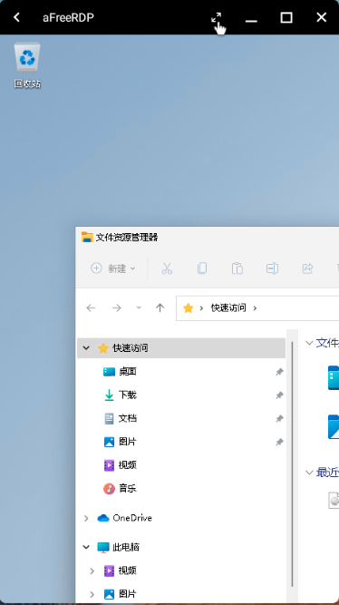

16. 现在就可以通过共享目录传入安装包安装对应应用，或者使用浏览器下载软件包安装使用了

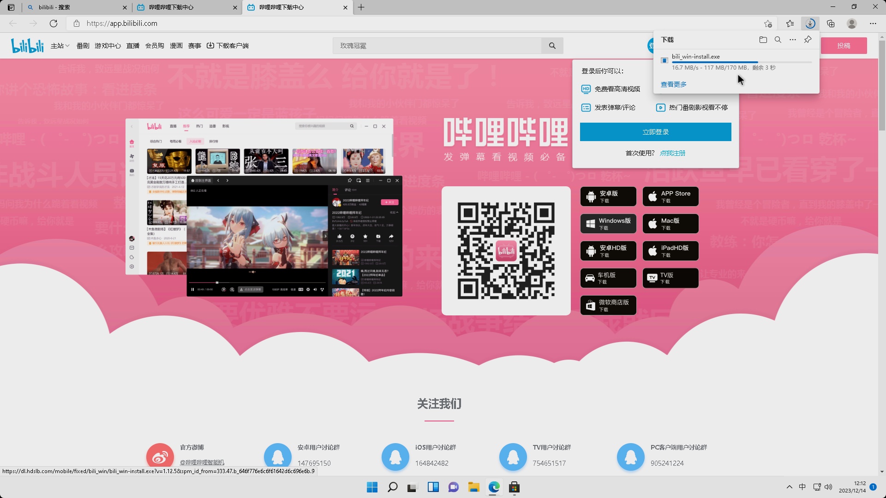
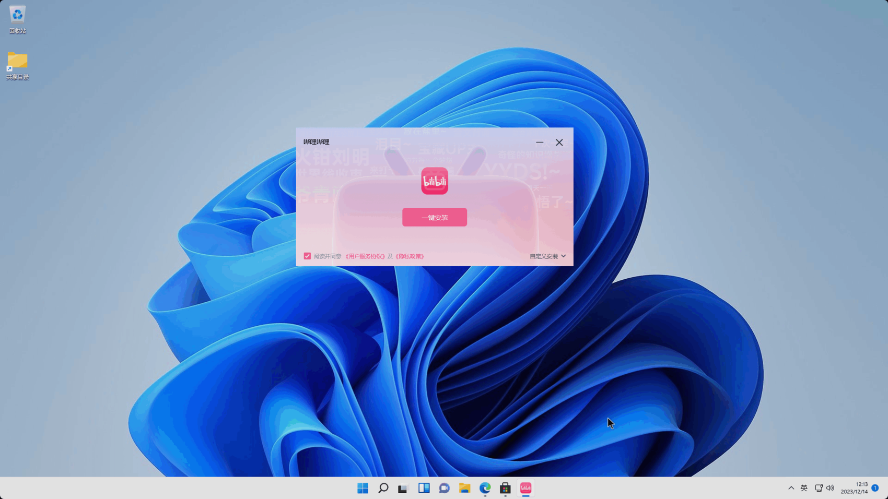
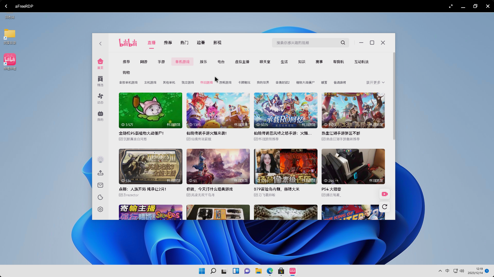

想要了解如何将tiny11汉化成中文使用，请参考[tiny11操作系统汉化](./../2023-12-22-chinese-tiny/chinese-tiny11.md) 