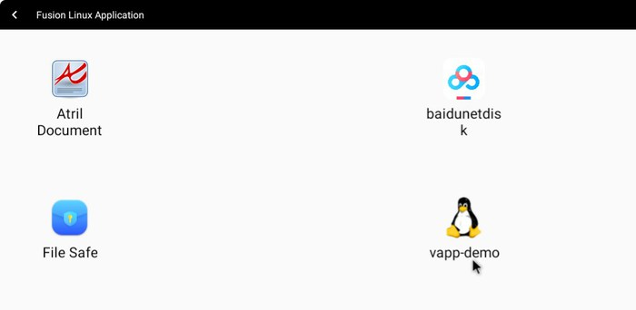
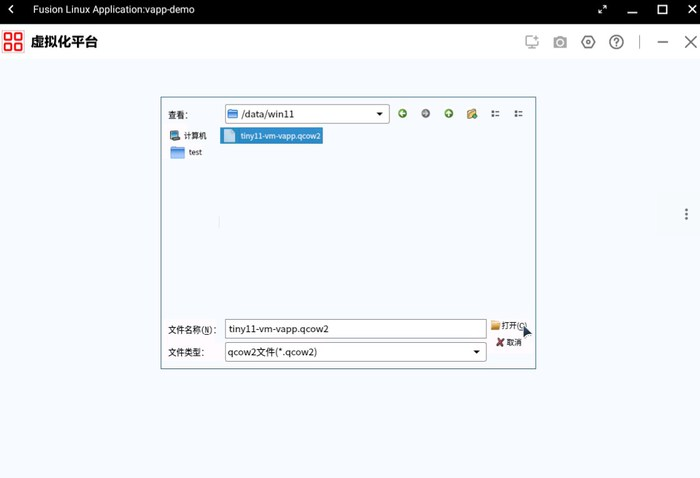
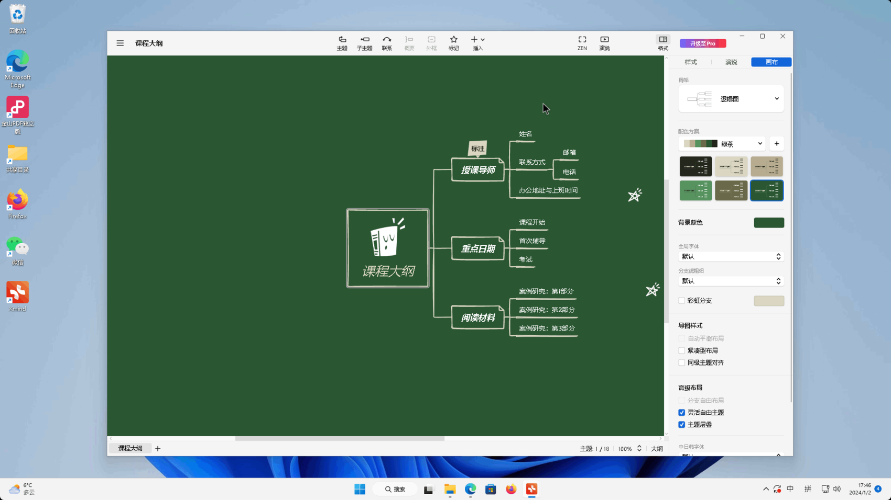
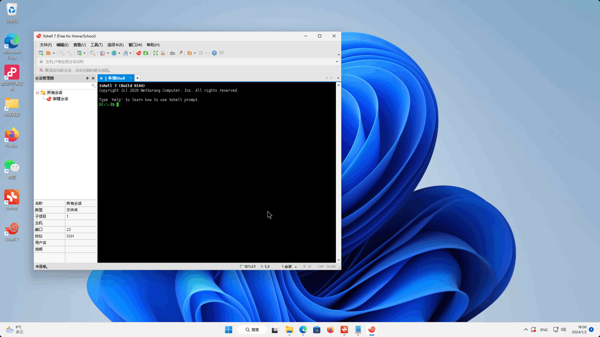

本博客介绍如何在OpenFDE使用win11应用，主要在OpenFDE安装phyvirt-fde，导入已有win11镜像qcow2创建虚拟机，下载win11应用包并安装使用
<!--truncate-->

### 软硬件资源{#resource}

#### 硬件{#hardware}

* 4CPU
* 16GB MEM
* 硬盘10GB
* 内核版本: 5.4.18-85-generic
* aarch64 
  
#### 软件{software}

* Kylin V10 SP1
* phyvirt-fde：
  * 通过命令“sudo apt install phyvirt-fde -y”安装
  * 目前版本仅支持Phytium CPU part为0x662和0x663的机器，可使用命令“cat /proc/cpuinfo”查看是否匹配
* win11虚拟机qcow2：tiny11-vm-vapp.qcow2（7.2GB）
  * 使用tiny11制作，它是一款对win11进行极致精简的定制系统,它的特点是在资源受限的情况下，用户依然能够获得流畅的使用体验
  * 该镜像用户名与密码都是pvuser,成功创建虚拟机后可自行修改
  * 文件存放于夸克网盘，下载地址为 https://pan.quark.cn/s/d1845706339e

### 安装前提{#requirements}

OpenFDE已安装完毕并登录openfde桌面

### 搭建步骤{#steps}

1. 在OpenFDE中点击"开始菜单->Fusion Linux Application",找到linux的终端应用Konsole，输入以下命令安装phyvirt-fde
```
sudo apt update
sudo apt install phyvirt-fde -y
```


2. 在"开始菜单->Fusion Linux Application"中打开vapp-demo
   



   
3. 点击“基于已有镜像创建”，找到已有的win11虚拟机qcow2文件(tiny11-vm-vapp.qcow2)打开
   




4. 输入虚拟机名，操作系统类型、CPU数量、内存大小等信息，点击右下角确认创建虚拟机后直接关闭vapp-demo
   


5. 重启OpenFDE桌面，点击"开始菜单->phyvirt"打开,可见有新建的虚拟机tiny11


<font color="red">ps:当前版本如果不重启OpenFDE桌面会导致之后的步骤按钮无法操作</font>

6. phyvirt上启动虚拟机


7. 待右下角状态为“就绪”，可点击“RDP”进入虚拟机
  


<font color="red">ps:请点击"RDP”正中心，目前版本点击边缘或者“我的桌面”不会响应</font>

8. 将窗口全屏就可以正常使用了
    


### 安装应用{#install-applications}
* 方法一
  镜像自带有浏览器Edge,可用此下载软件包安装使用


* 方法二
  phyvirt中默认的共享目录路径为“~/桌面/share",可将安装包放入其中，在虚拟机中点击安装
  ```
  cp ~/下载/exe/ ~/桌面/share/ -r
  ```
  
  

  

  

  

### 应用展示{#application-display}
* Xmind
  


* Xshell



* QQ游戏
  


### 致谢{#thanks}
感谢飞腾公司基于phyvirt基础上，为OpenFDE提供了phyvirt-fde