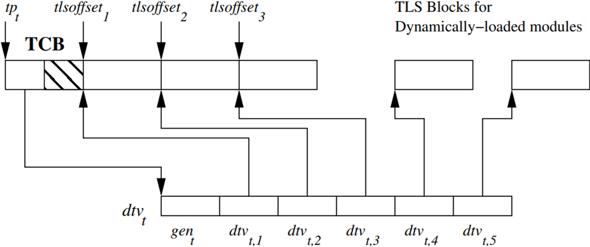
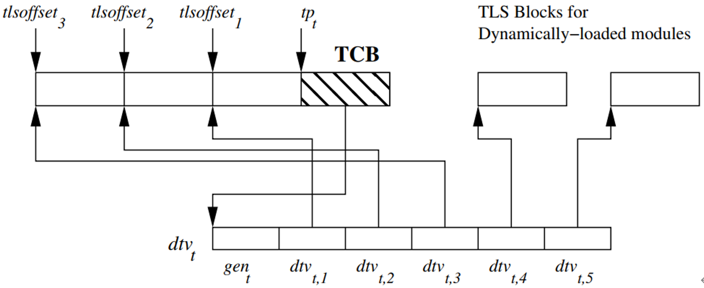
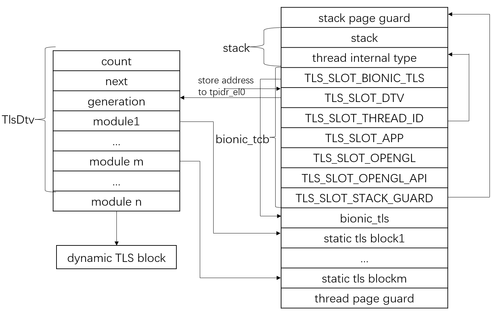
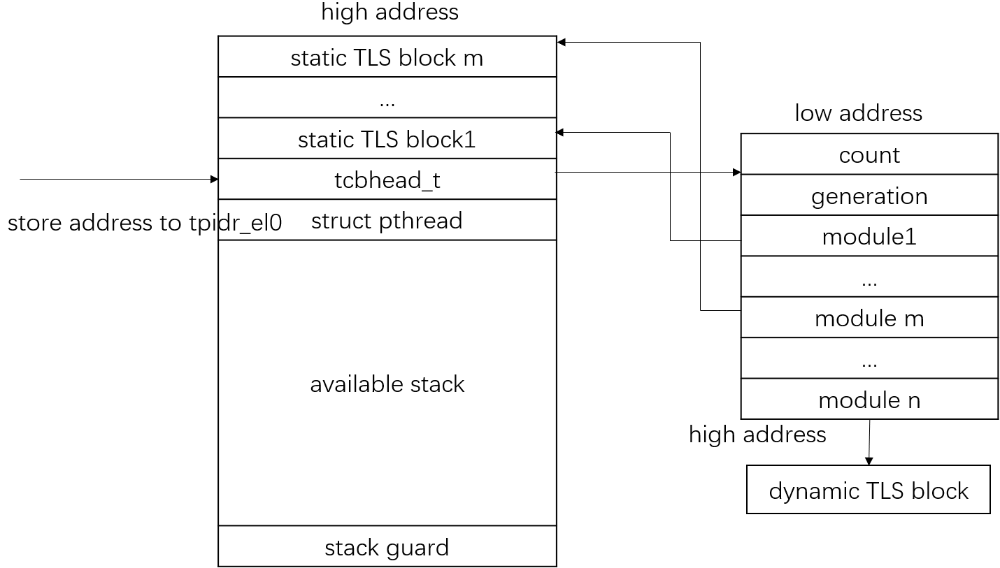

本博客主要介绍TLS(Thread Local Storage)的基础概念和原理实现。

<!--truncate-->

## 概述{#overview}

TSL(Thread Local Storage)全称为线程本地存储变量，指每个线程有独立的存储，进程内不共享。对于TLS变量来说，不同的线程指向不同的存储空间。它的实现涉及高级编程语言、编译器和链接器的支持。

### TLS变量的申请{#apply-tls}

在高级编程语言中，在多线程环境下定义申请TLS变量，线程间对TLS变量的修改互不影响，像普通变量一样可以在赋值语句中读写访问。

### 线程的动态管理{#manage-tls}

除了主线程外，其它线程都在程序运行时创建和销毁，在加载共享对象文件时，无法确认何时创建线程，创建多少线程等信息。因此对TLS变量libc需要进行动态管理。由于不同线程访问TLS变量的地址空间不一样，libc需要管理TLS变量的地址空间，需要动态获取TLS变量地址。

编译器和链接器将动态库中所有的TLS变量放在同一个TLS程序段中，TLS变量相对于TLS程序段的偏移是固定的。

### TLS变量的实现方式{#implement-tls}

为了优化TLS变量的访问性能，TLS变量的实现采用了以下四种方式，性能逐步增加，实现场景逐步减少。

- Generic Dynamic：通用方式，每个TLS变量的访问都需函数调用获取地址。可跨动态库引用访问
- Local Dynamic：局部方式，在函数内多个TLS变量引用，通过函数调用获取TLS程序段的地址，TLS变量通过对TLS程序段的偏移获取地址。只能在动态库内引用访问
- Initial Exec：段寄存器和TLS变量偏移间接寻址，在主程序起始时静态加载的动态库中引用访问
- Local Exec：段寄存器和TLS变量偏移直接寻址，只能在主程序中引用访问

另外有一个对GD的优化的访问模式TLSDESC。优化主要包括优化static TLS block中TLS变量访问，减少函数调用对寄存器污染，减少原子操作访问等

### 编译器访问TLS变量的方式{#access-tls-in-translator}

编译器一般用tls-dialect和tls-model2个选项支持5种访问方式：

    -mtls-dialect=trad -ftls-model=global-dynamic : GD方式
    -mtls-dialect=trad -ftls-model=local-dynamic ：LD方式
    -mtls-dialect=trad -ftls-model=initial-exec  ：IE方式
    -mtls-dialect=trad -ftls-model=local-exec  ：LE方式，只支持主程序，不支持动态库
    -mtls-dialect=desc ：TLSDESC方式

> 注：以上为aarch64的编译选项，x86_64的tls-dialec编译选项值与aarch64不同，为gnu和gnu2，分别对应trad和desc

### C/C++的TLS变量修饰符{#tls-modifier-types}

<table style={{textAlign: 'center'}}>
	<tr>
		<th>Specifier</th>
        <th>Notes</th>
	</tr>
    <tr>
        <td rowspan="2">__thread</td>
        <td>- non-standard, but ubiquitous in GCC and Clang</td>
    </tr>
    <tr>
        <td>- cannot have dynamic initialization or destruction</td>
    </tr>
    <tr>
        <td rowspan="2">_Thread_local</td>
        <td>- a keyword standardized in C11</td>
    </tr>
    <tr>
        <td>- cannot have dynamic initialization or destruction</td>
    </tr>
     <tr>
        <td rowspan="2">thread_local</td>
        <td>- C11: a macro for _Thread_local via threads.h</td>
    </tr>
    <tr>
        <td>- C++11: a keyword, allows dynamic initialization and/or destruction</td>
    </tr>
</table>

## TLS数据结构介绍

Drepper根据静态加载和动态加载共享对象的不同场景提供了内存布局的两种实现，基本原理类似。

- 定义一个动态线程数组，名为dtv，每个元素指向动态库的TLS程序段内容在当前线程的位置，该数组可动态增加
- 分配一段静态的物理内存，称之为静态TLS块（static tls block），一旦分配不能增减，大部分用来存储TLS段内容，一小段内存用来存储线程控制块（TCB），该TCB指向dtv数组
- 动态加载的动态库，为每个动态库的TLS程序段分配一段内存，称之为动态TLS块（dynamic tls block），由dtv元素指向这段内存
- 使用CPU某个专用段寄存器保存线程指针地址（tp），如：x86_64的%fs段寄存器，aarch64的tpidr_el0段寄存器



<center>图1 aarch64 TLS基本数据结构</center>



<center>图2 x86_64 TLS基本数据结构</center>

### TLS数据布局

这里分别列出gnu和bionic的arrch64 TLS数据布局，gnu的实现与图1的结构类似，bionic的实现的TCB定义不一样，其它类似。



<center>图3 bionic aarch64 TLS数据布局</center>

图3为bionic线程栈的物理布局图，地址从上往下增加，静态TLS块内存分配在线程栈上，TCB大小为bionic_tcb数据结构大小，而非16字节。静态TLS块紧挨着bionic_tcb数据结构。



<center>图4 gnu aarch64 TLS数据布局</center>

图4为gnu线程栈的物理布局图，地址从下往上增加，静态TLS块内存分配在线程栈上，TCB大小为tcbhead_t数据结构大小（16字节）。静态TLS块紧挨着tcbhead_t数据结构。

### 静态TLS空间

涉及静态TLS空间，TCB管理空间（bionic_tcb），线程指针（tp ），动态线程数组（dtv）等。

- 静态TLS空间：静态TLS空间涉及静态TLS空间和TLS管理空间，一段连续的物理内存，一般分配在线程栈上，动态库的tls_offset相对于该空间计算的
- 线程指针：线程指针需要保存在段寄存器中，变种1的TCB所占空间需要与编译器达成一致，以满足LE访问方式的要求，如：bionic的TCB所占空间为64，要求编译器生成主程序TLS变量访问指令时，增加64的偏移量。变种2约定偏移为0，因此无此要求。
- TCB管理空间：记录线程指针、动态线程数组，线程局部数据管理等地址，bionic在aarch64定义的空间大小为9个8字节数组共72字节，比线程指针与第一个TLS变量的偏移大8，因此线程指针指向其第二个元素地址。另外，TCB管理空间涉及字节对齐问题，因此与静态TLS空间的起始地址可能不一样，这可能与bionic的实现相关
- 动态线程数组：记录每个动态库的TLS程序段的起始位置，其地址保存在线程指针指定的空间中。

### bionic TLS数据结构初始化流程

动态链接器对TLS数据结构的初始化分两部分，一部分在加载主程序过程中，称之为静态加载库，另一部分在主程序运行中调用dlopen加载动态库过程中，称之为动态加载库。

#### 静态加载库初始化TLS

动态链接器在加载主程序过程中，使用StaticTlsLayout和TlsModules两个全局变量初始化TLS数据结构。

- StaticTlsLayout类型变量计算每个依赖库TLS程序段在静态TLS块的偏移。
- TlsModules类型变量计算拥有TLS程序段的所有动态库

在主程序加载过程中，所有的TLS程序段都存储在静态TLS块内存块中，具体步骤如下：

1. 在linker初始化过程中，调用__libc_init_main_thread_early初始化bionic_tcb和tpidr_el0，调用__init_tcb_dtv初始bionic_tcb中的TLS_SLOT_DTV，其更新标志值为0
2. 调用linker_setup_exe_static_tls：（假设主程序包含TLS程序段）
   - a. 在StaticTlsLayout类型变量中预留bionic_tcb对象和TLS空间以及其位置
   - b. 调用register_tls_module获得module id，并加入TlsModules类型变量中
   - c. 预留bionic_tls对象空间及其位置
3. 加载主程序依赖库，若存在TLS程序段，调用soinfo::register_soinfo_tls在StaticTlsLayout类型变量中预留TLS空间和位置，并加入TlsModules类型变量中
4. 调用linker_finalize_static_tls，计算StaticTlsLayout类型变量中预留空间总大小，即为静态TLS块大小
5. 调用__allocate_thread_mapping，为静态TLS块分配内存空间，空间分配在主程序的栈上。静态TLS块空间包括：bionic_tcb、bionic_tls以及TLS程序段。
6. 调用__init_static_tls，将TlsModules类型变量中动态库的TLS段内容拷贝至静态TLS块空间中。
7. 调用bionic_tcb::copy_from_bootstrap同步第一步初始化bionic_tcb的内容
8. __init_tcb更新bionic_tcb
9. 调用__init_bionic_tls_ptrs更新bionic_tls地址
10. 调用__set_tls设置静态TLS块地址至段寄存器tpidr_el0中
11. 重定位初始化TLS变量的GOT表项
    - GD：重定位类型包括R_AARCH64_TLS_DTPMOD64和R_AARCH64_TLS_DTPREL64，分别将其相邻的GOT表项初始化为module id和变量在其TLS段中的偏移
    - LD：aarch64对LD的实现与GD相同，而x86_64的实现不同，其重定位类型为R_X86_64_DTPMOD64，分别将其相邻的GOT表项初始化为module id和偏移0
    - IE：重定位类型为R_AARCH64_TLS_TPREL64，将其GOT表项值初始为static STL block上的偏移
    - LE：无重定位项和GOT表项，不需要初始化
    - TLSDESC：重定位类型为R_AARCH64_TLSDESC，将其相邻的GOT表项初始化为tlsdesc_resolver_static函数地址和静态TLS块上的偏移量

从上初始化流程中，可看出dtv数组为空，dtv数组只在访问TLS变量时才会创建，这种延时分配的好处有：

- 对于TLS变量的IE和LE访问方式来说，可直接通过段寄存器和偏移量来获得TLS变量的地址，不需要通过dtv数组查找。
- 对于TLS变量的GD和LD访问方式来说，通过调用__tls_get_addr函数获取TLS变量地址，在其检查dtv数组为空时，根据TLS动态库的数量重新分配dtv数组空间
- 对于TLS变量的TLSDESC访问方式来说，其tlsdesc_resolver_static函数直接返回TLS变量在static STL block上的偏移量，也无需分配dtv数组

从上面的用例看，TLSDSC访问方式相对于GD来说，对静态TLS块上的TLS变量的访问优化是显著的，TLSDESC方式直接返回GOT表项中的静态TLS块偏移量，而GD方式需要访问dtv数组，计算而得其地址。

#### 动态加载库初始化TLS

bionic通过dlopen动态加载库，初始TLS的步骤如下：

1. 在do_dlopen->find_library->soinfo::register_soinfo_tls→register_tls_module流程中，获得module id，并加入至TlsModules类型变量中
2. 在soinfo::relocate->plain_relocate->plain_relocate_impl->process_relocation→process_relocation_impl流程中重定位初始化TLS变量的GOT表项
   - GD：重定位类型包括R_AARCH64_TLS_DTPMOD64和R_AARCH64_TLS_DTPREL64，分别将其相邻的GOT表项初始化为module id和变量在其TLS段中的偏移
   - LD：aarch64对LD的实现与GD相同
   - IE/LE：不支持
   - TLSDESC：重定位类型为R_AARCH64_TLSDESC，将其相邻的GOT表项初始化为tlsdesc_resolver_dynamic函数地址和TlsDynamicResolverArg类型变量地址
     - a. 初始化TlsDynamicResolverArg中TlsIndex的module id以及offset，offset的值为TLS变量在其TLS程序段的偏移量。另外初始化更新标志为库的更新标志，该标志表示动态库是否有更新;
     - b. 为了存储TlsDynamicResolverArg类型变量，将变量保存在soinfo::tlsdesc_args_数组中，为处理数组重新分配内存，Relocator::deferred_tlsdesc_relocs缓冲重定位信息，当该库的所有重定位操作完成后，再更新TLS变量的GOT表项.

#### 线程创建过程中初始化TLS

调用pthread_create创建线程，需要对主程序上的所有TLS数据结构进行拷贝。（pthread_create->__allocate_thread）

1. 调用__allocate_thread_mapping分配线程栈空间，包含了静态TLS块空间。（Allocate in order: stack guard, stack, static TLS, guard page）
2. 调用__init_static_tls，将TlsModules类型变量中动态库的TLS段内容拷贝至静态TLS块空间中。
3. 调用__init_tcb更新bionic_tcb
4. 调用__init_tcb_dtv初始bionic_tcb中的TLS_SLOT_DTV，其更新标志值为0。
5. 调用__init_bionic_tls_ptrs更新bionic_tls地址
6. 调用clone，将静态TLS块地址传递给clone，由内核设置段寄存器tpidr_el0值

#### __tls_get_addr函数实现

GD/LD访问方式使用__tls_get_addr函数获取TLS变量绝对地址。__tls_get_addr函数涉及对dtv数据更新，其更新的条件由3个更新标志（generation）控制

- 全局generation，保存在__libc_tls_generation_copy，为TlsModules::generation一个副本，每次新增拥有TLS程序段的动态库时，递增该值，表示有动态库新增。不需要处理动态库删除问题
- dtv数组中的generation，保存在数组中的第一个元素，初始化为0，每次更新dtv数组时，更新generation只为当时的全局generation值。与全局generation不相等，说明有新的动态库加载，需要更新dtv数组内容
- 动态库的generation，保存在TlsModule::first_generation，该值初始化为加载该库时全局generation的值。该值用于判断dtv指向的动态库是否有变化，即是否为旧的动态库

```
struct TlsIndex {
  size_t module_id;
  size_t offset;
};

// ti的值保存在动态库的GOT表项中，在重定位时初始化，占两个表项内容

extern "C" void* __tls_get_addr(const TlsIndex* ti){

//  获取dtv数组

TlsDtv* dtv = __get_tcb_dtv(__get_bionic_tcb());

// 获取全局动态库更新标志

size_t generation = atomic_load(&__libc_tls_generation_copy);
  if (__predict_true(generation == dtv->generation)) {

void* mod_ptr = dtv->modules[__tls_module_id_to_idx(ti->module_id)];
    if (__predict_true(mod_ptr != nullptr)) {

      // 无动态库更新，且内存已分配，则进入快速路径，返回TLS变量偏移地址
      return static_cast<char*>(mod_ptr) + ti->offset + TLS_DTV_OFFSET;
    }

    // 延时分配动态库的动态TLS块内存，只有访问该动态库的TLS变量时才分配内存，进入慢速路径
  }

  // 有动态库更新或者第一次访问，进入dtv和动态TLS块的分配和初始化

  return tls_get_addr_slow_path(ti);
}
```

tls_get_addr_slow_path函数包含dtv和动态TLS块的分配和初始化.

```
__attribute__((noinline)) static void* tls_get_addr_slow_path(const TlsIndex* ti) {
  TlsModules& modules = __libc_shared_globals()->tls_modules;
  bionic_tcb* tcb = __get_bionic_tcb();
  ScopedSignalBlocker ssb;

  // 互斥写，防止多线程同时修改__libc_shared_globals()->tls_modules全局变量
  ScopedWriteLock locker(&modules.rwlock);

  // 更新dtv数组或者重新分配数组内存

  update_tls_dtv(tcb);

  TlsDtv* dtv = __get_tcb_dtv(tcb);
  const size_t module_idx = __tls_module_id_to_idx(ti->module_id);
  void* mod_ptr = dtv->modules[module_idx];
  if (mod_ptr == nullptr) {

    // 不存在，则分配内存，将动态库TLS程序段内容拷贝至新内存，并初始化该模块指针
    const TlsSegment& segment = modules.module_table[module_idx].segment;
    mod_ptr = __libc_shared_globals()->tls_allocator.memalign(segment.alignment, segment.size);
    if (segment.init_size > 0) {
      memcpy(mod_ptr, segment.init_ptr, segment.init_size);
    }
    dtv->modules[module_idx] = mod_ptr;

    // Reports the allocation to the listener, if any.
    if (modules.on_creation_cb != nullptr) {
      modules.on_creation_cb(mod_ptr, static_cast<void*>(static_cast<char*>(mod_ptr) + segment.size));
    }
  }

  return static_cast<char*>(mod_ptr) + ti->offset + TLS_DTV_OFFSET;
}
```

update_tls_dtv动态分配dtv数组空间，代码太多不再列出，其实现步骤如下：

1. 更新dtv数组的条件：dtv数组的更新标志与全局动态库更新标志不相等，说明动态库有更新，当前指向的为旧的动态库
2. 重新分配dtv数组，条件条件为拥有TLS程序段的动态库总数量大于dtv数组大小

   - a. 根据动态库数量重新分配dtv数组空间
   - b. 将dtv数组中的内容备份至新的dtv数组空间
   - c. 调用__set_tcb_dtv更新为新的dtv数组
   - d. 为实现无锁操作，不释放旧的dtv数组空间，而是将其插入一个垃圾回收队列中，待程序结束时回收
3. 重新更新静态TLS块对应动态库的dtv数组元素
4. 重新更新动态TLS块对应动态库的dtv数组元素，条件：动态库的更新标志大于dtv数组更新标志（表明dtv数组指向的为旧的动态库）
   - a. 释放旧的动态库动态TLS块内存
   - b. 将dtv数组元素清零
5. 更新dtv数组的更新标志为全局动态库更新标志

#### TLSDESC访问方式实现

TLSDESC访问方式有两种方式获取TLS变量相对静态TLS块的偏移地址：一种对于静态TLS块上的TLS变量由tlsdesc_resolver_static获取，另一种对于动态TLS块的TLS变量由tlsdesc_resolver_dynamic获取。这两种方式都采用汇编实现，不遵循C/C++函数调用的寄存器传参规范。其使用规范中的返回值寄存器传参，如aarch64的x0寄存器，x86_64的rax寄存器。

```
/* Type used to represent a TLS descriptor in the GOT.  */

struct TlsDescriptor {
  TlsDescResolverFunc* func;
  size_t arg;
};

// tlsdesc_resolver_static函数，其TlsDescriptor::arg值为TLS变量的相对偏移

// tlsdesc_resolver_dynamic函数，其TlsDescriptor::arg值为下列类型变量地址

struct TlsDynamicResolverArg {
  size_t generation;
  TlsIndex index;
};

struct TlsIndex {
  size_t module_id;
  size_t offset;
};
```

tlsdesc_resolver_static的实现相当简单，返回TlsDescriptor::arg值即可。

tlsdesc_resolver_dynamic对更新标志的判断有所优化，共有4个generation更新标志：

1. 全局generation，保存在__libc_tls_generation_copy，为TlsModules::generation一个副本，每次新增拥有TLS程序段的动态库时，递增该值，表示有动态库新增。不需要处理动态库删除问题
2. dtv数组中的generation，保存在数组中的第一个元素dtv[0]，初始化为0，每次更新dtv数组时，更新generation只为当时的全局generation值。与全局generation不相等，说明有新的动态库加载，需要更新dtv数组内容
3. 动态库的generation，保存在TlsModule::first_generation，该值初始化为加载该库时全局generation的值。该值用于判断dtv指向的动态库是否有变化，即是否为旧的动态库
4. TLS变量GOT表项中指向的TlsDynamicResolverArg::generation，该值初始化为TlsModule::first_generation值，该值只要不大于dtv数组中的generation不需要重新分配dtv数组，否则表示该动态库的TLS程序段在dtv数组中未初始化。

tlsdesc_resolver_dynamic实现步骤：

1. 快速路径，条件：TlsDynamicResolverArg::generation <= dtv[0] && dtv[mod_id] != NULL
    a. 返回 dtv[mod_id] + TlsDynamicResolverArg::TlsIndex::offset相对于静态TLS块的偏移
2. 慢速路径，调用__tls_get_addr获取TLS变量的绝对地址，返回与静态TLS块的相对偏移

### gnu TLS数据结构初始化流程

原理与bionic TLS数据结构初始化流程类似，不再详述。两者的差异包括：

- 静态加载库初始化TLS时，gnu会为静态TLS块预留144字节空间
- 动态加载库初始化TLS时，先从预留的静态TLS块获取空间，不足时采用动态TLS块，这种方式可满足调用dlopen动态加载的TLS变量IE访问方式的动态库
- TLSDESC实现函数名称不同：_dl_tlsdesc_return/_dl_tlsdesc_dynamic/_dl_tlsdesc_undefweak -> tlsdesc_resolver_static/tlsdesc_resolver_dynamic/tlsdesc_resolver_unresolved_weak

预留静态TLS空间的作用有两个，一个是支持动态加载IE访问模式的库，另一个是优化TLSDESC访问模式性能。

在linux环境下，图形加速库（OpenGL/EGL）的使用预留静态TLS空间的典型应用。一般linux应用程序会使用图形API转发库，如glvnd，图形API转发库通过dlopen动态加载OpenGL/EGL库，而OpenGL/EGL库一般都使用了IE访问模式的TLS变量，通常是一个指针变量，指向一个数据结构，从而减少静态TLS块预留空间的占用。

预留静态TLS空间注意事项：

- 分配时机：glibc在重定位时尝试分配静态TLS空间，支持的两个重定位类型，分别为R_AARCH64_TLSDESC和R_AARCH64_TLS_TPREL
- 初始化数据：对所有线程的静态TLS空间进行初始化，TLS数据结构在线程栈上，有的线程使用用户栈，有的使用系统栈，在_dl_init_static_tls函数中实现
- 并发互斥访问：预留静态TLS空间分配在dl_open_worker_begin中实现，调用函数前加了一把大锁dl_load_tls_lock；初始化静态TLS数据时，在_dl_init_static_tls函数内加了一把锁dl_stack_cache_lock