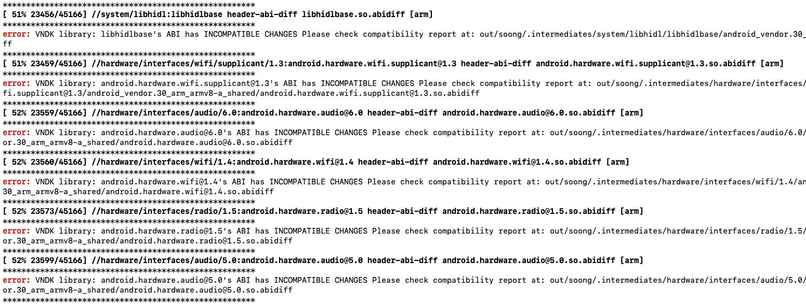

# 快速开始{#quick-start}

&emsp;&emsp;本文档用于指导OpenFDE开发爱好者如何快速编译OpenFDE源码。编译工作包括AOSP代码编译、Android APK编译和Linux程序编译三个部分。

## 1. AOSP源码编译 {#aosp-build}

### 1.1 准备环境 {#preparation}

&emsp;&emsp;AOSP源码编译需要准备一台<mark>多核的X86主机，内存要求16G，硬盘大小最低要求配备512G</mark>，这里建议优先使用固态硬盘，当然你也可以使用机械硬盘，但是编译速度可能会很慢。

### 1.2 安装Ubuntu22.04{#install-ubuntu22.04}

&emsp;&emsp;准备好主机后，需要在你的环境上安装Ubuntu22.04, 友情提供下载链接：https://ubuntu.com/download/server。

### 1.3 下载repo脚本文件{#download-repo}

&emsp;&emsp;Android通常使用repo脚本管理源码树，方便大家用一个命令就可以下载几百个仓库。你需要依次执行下面的命令来下载repo脚本文件。

```
curl https://mirrors.tuna.tsinghua.edu.cn/git/git-repo -o repo
chmod +x repo
sudo mv repo /usr/local/bin/repo
export REPO_URL='https://mirrors.tuna.tsinghua.edu.cn/git/git-repo'
echo export REPO_URL='https://mirrors.tuna.tsinghua.edu.cn/git/git-repo' >> ~/.bashrc
```

### 1.4 安装编译依赖库{#install-dependencies}

```
sudo apt install git-core gnupg flex bison gperf build-essential zip curl zlib1g-dev gcc-multilib g++-multilib libc6-dev-i386 lib32ncurses5-dev x11proto-core-dev libx11-dev lib32z-dev libgl1-mesa-dev libxml2-utils xsltproc unzip libncurses5
```

### 1.5 下载源码{#download-source-code}

```
mkdir fde && cd fde
sudo apt install git git-lfs -y
repo init -u https://gitee.com/openfde/manifests -b 1.0.5 --git-lfs
repo sync -j24
```

### 1.6 编译源码{#build-source-code}

```
source build/envsetup.sh
syncFdeApk
lunch 46 
make -j24
```

其中```syncFdeApk```命令会从公网对象存储中下载当前版本匹配的apk到aosp源码树对应位置。如果修改了对应的apk源码，需要重新编译apk源码，请参考[Android APK编译](./build-android-apk)。

<mark>如果在编译过程中出现下图中的编译错误，请忽略，不影响编译过程。</mark>



## 2. Linux程序编译{#build-linux}

### 2.1 编译前准备{#requirements}

Linux程序编译需要在**ARMv8架构**的主机上进行，你需要选定一个工程目录来编译和安装Linux相关程序，下面各小节的操作都在工程目录如`openfde-linux/`下进行。<mark>如果不是首次编译，请确保将各个依赖库的代码同步更新到最新。</mark>

下面将详细介绍在不同的操作系统上编译Linux程序。

### 2.2 Kylin2303上编译Linux程序{#build-linux-on-kylin2303}

你可以执行下列命令进行一键编译Linux程序。

```
git clone https://gitee.com/openfde/quick_start_to_compile_linux_programs && cp -a quick_start_to_compile_linux_programs/build_linux_for_fde.sh . && ./build_linux_for_fde.sh
```

如果想要了解更详细的编译过程和细节，请前往[Kylin2303上编译Linux程序](./build-linux/build-linux-on-kylin2303)。