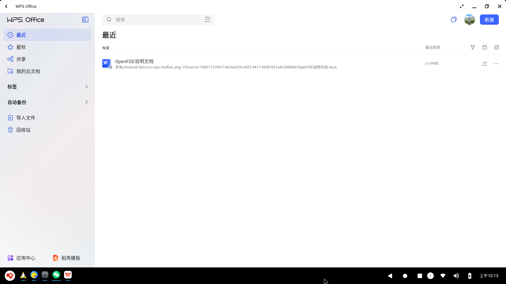
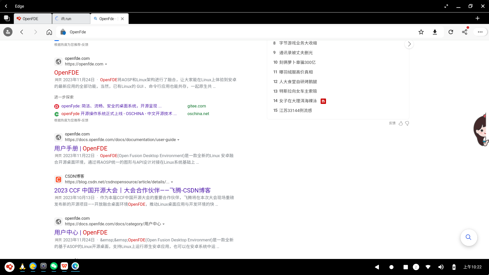
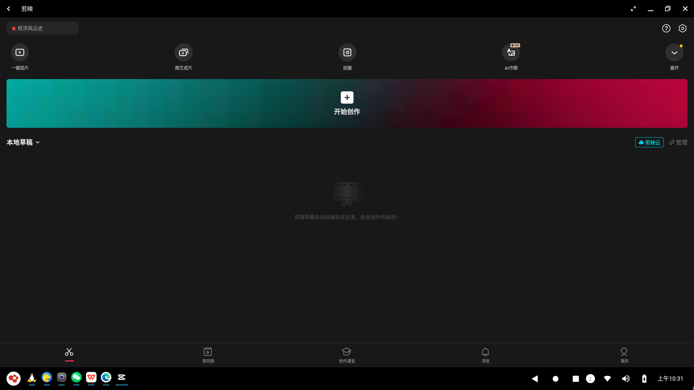
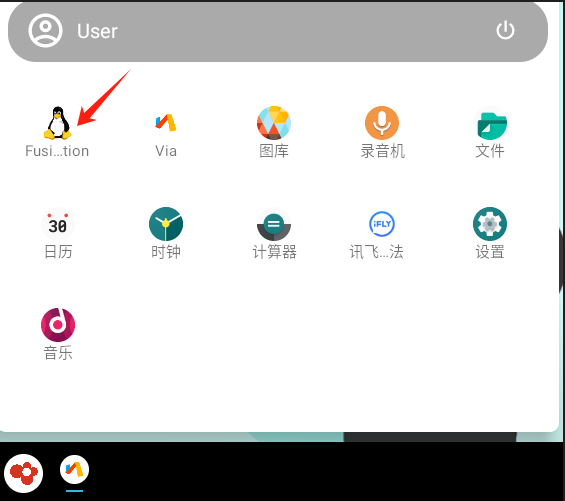
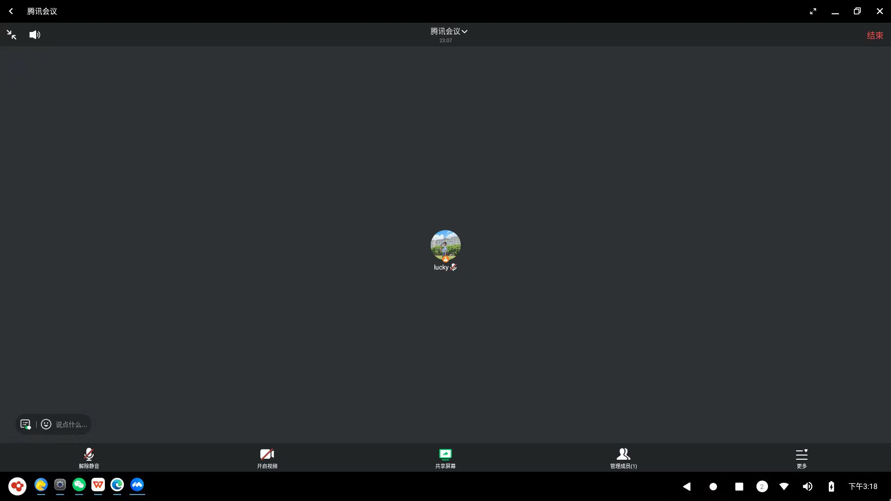
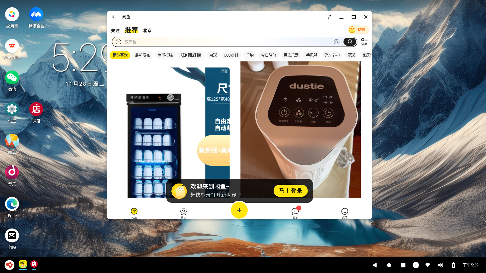
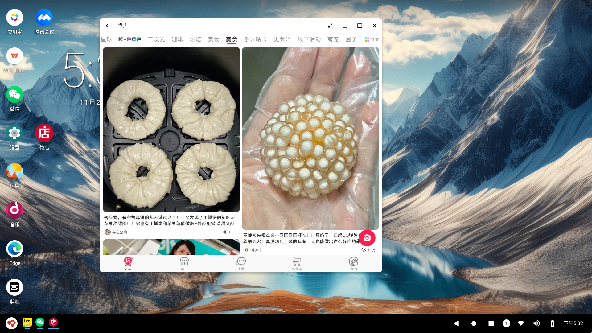

# APP推荐秘籍{#agguestion-app}

&emsp;&emsp;这篇乃实用篇！！小O在这里给大家重点推荐一些办公、社交、生活常用的软件应用，帮助你更好地使用OpenFDE来办公和娱乐。**在开始下面的阅读之前**，先确认一下你的OpenFDE上是否已经安装好应用宝，若是没有安装的话可以先去内置的via浏览器下载安装应用宝哦。

|   类型   |     APP清单 | 
|  :----:  |    :----:   |
| 办公类   |百度网盘、[WPS](#wps-office)、快影、Wink、黄油相机、百度浏览器、[腾讯会议](#tecent-meeting)、[Edge浏览器](#edge)       |
| 游戏类   |   欢乐斗地主、部落冲突、割绳子2    |
| 生活类   |   网易云音乐、知乎、bilibili、腾讯视频、小红书、抖音、快手|
| 购物类 |  拼多多、[闲鱼](#xianyu)、[微店](#weidian)  |
| 社交类   |    微信、QQ   |

## 办公类{#work-app}

### WPS Office

&emsp;&emsp;对于一些工作文档类的办公软件，小O推荐大家前往应用宝中安装WPS Office。安装成功后，会在开始菜单和桌面自动生成WPS Office的快捷方式。任意在其中一处快捷方式点击WPS Office快速打开应用。

&emsp;&emsp;你可以将点击窗口右上角将WPS Office应用全屏或最大化，这样就可以很方便地开始各类文档办公！

### Edge浏览器{#edge}

&emsp;&emsp;日常办公当然离不开浏览器啦，这里小O给大家推荐前往应用宝中安装安卓版的Edge浏览器。安装成功后同样可以在开始菜单和桌面上找到Edge浏览器的快捷方式，打开应用后点击全屏或最大化，就可以快速开启你的各种上网搜索之旅。

### 图片和视频剪辑{#edit-pictures}

&emsp;&emsp;或许你有图片编辑、视频制作、视频剪辑之类的需求，小O推荐大家前往应用宝中安装美图秀秀或剪映。OpenFDE已经很好地支持了这两种图片视频剪辑APP。

&emsp;&emsp;同样地，你可以将应用全屏或最大化，相比于在手机上使用这类app剪辑操作的屏幕受限，OpenFDE支持将这些应用最大化，你可以使用鼠标更丝滑地进行图片或视频剪辑！

### Linux终端-Konsole{#konsole}

&emsp;&emsp;OpenFDE的一大特色就是Linux融合应用，也就是可以直接在安卓上运行Linux应用，其中就包括在Linux终端运行Linux命令等。

&emsp;&emsp;你可以在"开始菜单"找到Linux融合应用图标，打开Linux融合桌面。

&emsp;&emsp;在Linux应用列表中可能你会看到MATE Terminal、Konsole两个终端应用，两个终端应用都可以用来执行linux命令，**小O推荐大家使用Konsole**。

&emsp;&emsp;**推荐理由：**MATE Terminal在输入linux命令的时候可能会没有光标定位，后期我们的程序会逐渐完善优化。所以小O建议大家选择更丝滑的Konsole吧!

### 腾讯会议{#tecent-meeting}

&emsp;&emsp;OpenFDE支持安卓版的腾讯会议，你可以前往应用宝直接下载腾讯会议。在OpenFDE中你可以使用腾讯会议加入会议、开启快速会议、预约会议等，也可以共享屏幕、录制会议过程等。总之，你在手机上可以用到的腾讯会议功能，OpenFDE也都可以！

## 生活类{#life-app}

&emsp;&emsp;**下面重点来了！！！**众所周知，很多生活类的app几乎都不会提供桌面版，只有安卓客户端可以使用，比如闲鱼、微店等。但是在我们的OpenFDE可以让你在电脑上照常使用这些app应用，并且完整地使用安卓端的各种应用功能。

### 闲鱼{#xianyu}

&emsp;&emsp;你可以前往应用宝下载闲鱼，在开始菜单中找到闲鱼的快捷方式打开闲鱼。这里注意哦，**在首次打开闲鱼的时候你可能会遇到**：
- 标准窗口的闲鱼app可能没有显示最大化和最小化按钮，在第一次进入闲鱼app的时候用户协议"同意"的按钮也显示不出来，这是因为闲鱼不支持自由窗口模式。**你可以鼠标放到app的上下左右边界框，将app窗口拖宽一点或者拖长一点。**
- 当然，在你拖窗口的时候可能会出现闪退~不用担心！这是正常现象，尝试再次打开闲鱼app,再出现的就是你拖大窗口以后的效果的样子，直到右上角最小化、最大化、全屏功能按钮出现。
- 在浏览商品的过程中，app窗口拖得过大会出现出现一些空白的地方，窗口过小可能会导致部分商品栏无法完整显示，你可以继续拖动窗口，直到刚好满足你的浏览页面和使用需求。

&emsp;&emsp;总之，如果你在使用闲鱼的过程中遇到闪退的问题，不用慌张，**多拖动几次窗口，多尝试几次重新打开闲鱼**就可以正常使用啦！

### 微店{#weidian}

&emsp;&emsp;微店和闲鱼的安装方式类似，只需要正常安装和打开就可以正常使用的，且微店支持自由窗口模式，可以正常最大化和全屏，尽管放心使用！

