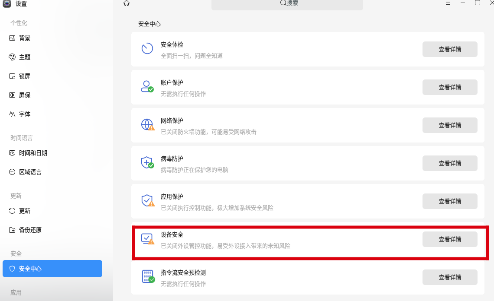
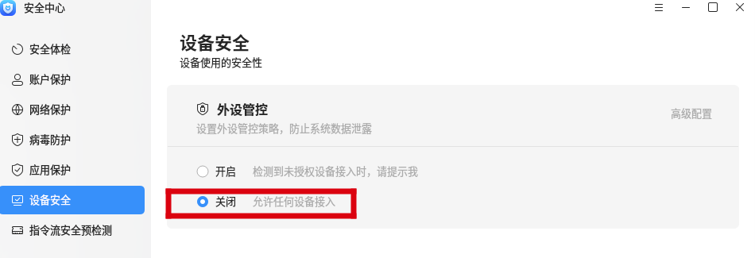
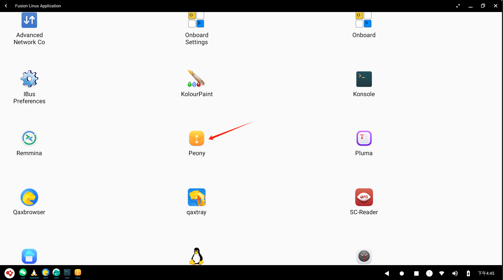
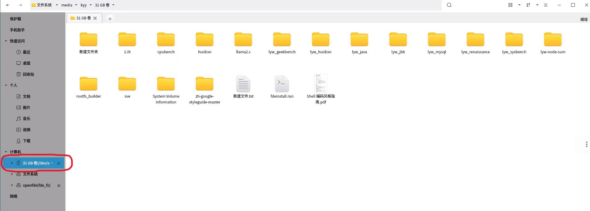
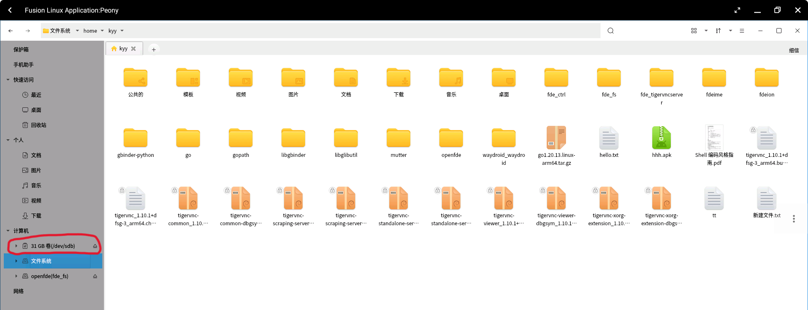
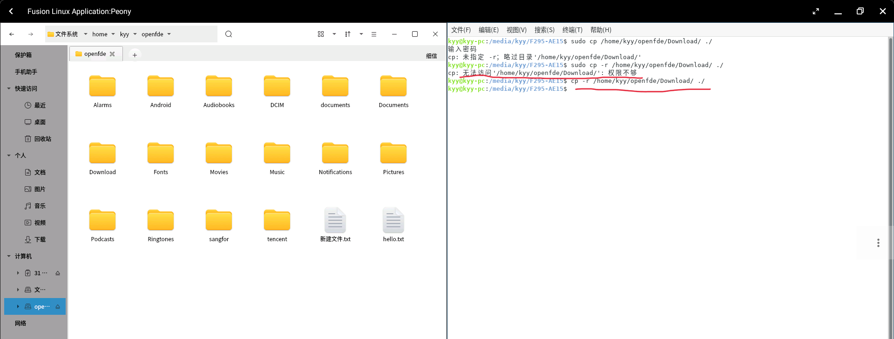

# 外接设备使用教程

## 设置要求{#settings}

首先需要关闭麒麟/Ubuntu系统的外设管控，进入“设置-安全中心-设备安全”。

将外设管控按钮设置成“关闭”。

## U盘接入和使用{#using-usb-flash-drive}

在USB接口插入U盘后，点击桌面左下角的OpenFDE图标，打开应用菜单中的Linux融合应用。

选择文件管理器Peony应用打开。

在文件管理器中左侧栏的“计算机”中可以看到识别出来的U盘，

### U盘文件传输{#transport-of-usb-file}

你可以将U盘中的文件拷贝到Linux文件系统中，也可以直接拷贝到安卓文件系统openfde(fde_fs)中。

- 拷贝U盘文件到Linux文件系统中

&emsp;&emsp;在U盘文件目录下(这里U盘示例为31GB卷)选中需要拷贝的文件或文件夹，点击“复制”，再进入"文件系统"/home/kyy/目录下，进行粘贴即可成功拷贝。<mark>注意哦，这里拷贝的文件或文件夹不能为空的。另外，拷贝的Linux目标路径尽量在你home目录下的文件夹，因为其他目录可能会没有访问权限。</mark>

- 拷贝文件到安卓文件系统中

&emsp;&emsp;在U盘文件目录下选中需要拷贝的文件或文件夹，点击“复制”，再进入到openfde(fde_fs),将文件或文件夹拷贝到目标路径下。<mark>这里同样需要注意，拷贝的文件或文件夹不能为空。</mark>

- 拷贝安卓文件到U盘

&emsp;&emsp;在Peony文件管理器中，选择openfde(fde_fs)目录下的任意文件或文件夹，点击“复制”，再进入到U盘目录下，将目标文件或文件夹拷贝到指定的路径，<mark>同样需要注意，不能拷贝空的文件和目录</mark>

> 友情提示：如果第一次点击复制，没有“粘贴”的选项，可以多尝试几次复制粘贴。

当然，也可以在终端界面使用cp命令进行文件或文件夹的拷贝，但是建议不要使用sudo进行拷贝。

- 拷贝Linux文件到U盘

操作与“拷贝安卓文件到U盘”一致，这里不再赘述。
