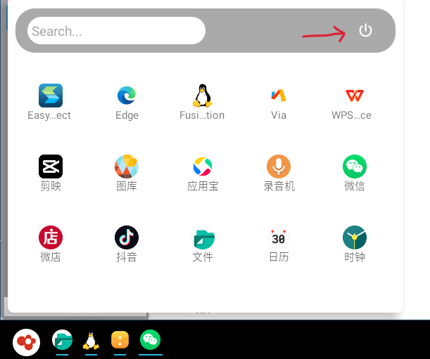

# 快速入门

&emsp;&emsp;OpenFDE是一个全新的Linux桌面环境设计探索项目，如KDE、GNOME一样，从登录到运行，服从Linux桌面环境体验。不同的是，OpenFDE的图形部分以ASOP为基础，能为Linux带来更丰富的应用软件与游戏，提供Android 与 Linux 应用程序一致的使用体验，和统一且新颖的 Linux 桌面应用开发模式，为Linux 桌面提供一种全新的打开方式。

<video width="720" height="405" controls>
    <source src="/img/install-guide.mp4" type="video/mp4" />
</video>

## 一、系统要求{#system-requirements}

我们研究适配了OpenFDE支持在不同的硬件平台和操作系统下安装，目前我们梳理了以下硬件平台和操作系统，请确保你的设备满足下列要求之一。

<table style={{textAlign: 'center'}}> 
  <tr>
    <th>硬件平台</th>
    <th>显卡</th>
    <th>操作系统</th>
    <th>内核</th>
    <th>内存</th>
  </tr>
  <tr>
    <td rowspan="2">Phytium D2000、FT2000/4</td>
    <td rowspan="2">AMD Radeon</td>
    <td>银河麒麟V10(SP1) 2203和2303版本(ARM64)</td>
    <td><font color="Red">linux-5.4.18-53及其以上</font></td>
    <td>最少8GB，推荐16GB及以上</td>
  </tr>
  <tr>
    <td>Ubuntu(支持ARM64)</td>
    <td>/</td>
    <td>/</td>
  </tr>
  <tr>
    <td>Phytium X100笔记本</td>
    <td>Phytium X100显卡</td>
    <td>银河麒麟V10(SP1) 2303版本(ARM64)</td>
    <td><font color="Red">linux-5.4.18-85及其以上</font></td>
    <td>最少8GB，推荐16GB及以上</td>
  </tr>
  <tr>
    <td>树莓Pi</td>
    <td>/</td>
    <td>Ubuntu(支持ARM64)</td>
    <td>/</td>
    <td>/</td>
  </tr>
</table>

- 如果你的设备已经满足了上述要求，就可以继续后面环节的快速安装操作。

- <mark>如果你的设备不满足上述要求，请务必先升级你的设备！！！</mark> 
  
- 对于**Phytium X100内核升级**，我们给出了详细的教程，请戳[Phytium X100安装OpenFDE](./install-details/install-on-x100)


## 二、关闭安全控制{#close-security-control}

为顺利安装和启动OpenFDE，在开始安装OpenFDE之前，你需要关闭当前系统所有的安全控制，在当前系统中选择设置-安全，进入安全中心。


以网络控制为例，关闭应用联网控制。同时，建议关闭应用保护、设备安全的相关控制。


## 三、快速安装{#installtion-steps}

我们提供了一键安装OpenFDE的脚本，你可以打开一个新的终端界面，按照下列操作从远程服务器上获取脚本并执行快速安装OpenFDE。

#### 步骤1. 安装curl工具{#install-curl}

```
sudo apt-get install curl
```

#### 步骤2. 下载脚本文件到本地{#get-script}

```
curl -fsSL https://openfde.com/getopenfde/get-openfde.sh -o get-openfde.sh 
```

#### 步骤3. 执行脚本文件{#execute-script}

```
sudo sh ./get-openfde.sh
```

> 在安装过程中可能会要输入"y"进行确认，你只需要按照提示正常输入就可以了。

更多详细教程可移步到[快速导航](./install-details/quick-guide)！

## 四、畅快使用{#happy-use}

### 1. 登录与注销{#login-and-logout}

#### 1.1 登录{#login}

- 进入登录页面：首次安装OpenFDE完成后，注销您的当前系统，进入到登录界面，此时在系统图标处可以看到新增有OpenFDE的选项。
  


- 切换登录系统：点击"FDE"后，既可切换到OpenFDE桌面环境进行登录。OpenFDE的账户和密码与您当前系统的账户密码是一致的。


#### 1.2 注销{#logout}

&emsp;&emsp;点击开始菜单，点击右上角的电源键按钮，会依次出现三个按钮，依次为关机、重启、注销。点击注销按钮即可退出到登录界面。



### 2. 配置输入法{#config-ime}

&emsp;&emsp;OpenFDE内置默认输入法为讯飞输入法，在"开始菜单"中找到"讯飞输入法"，即可快速打开讯飞输入法。选择启用讯飞输入法，同意隐私条款概要，即可自行配置输入键盘、键盘布局和皮肤字体等。

<mark>一个小tip: 如果你在使用讯飞输入法的过程中遇到类似下图中输入框遮挡住了文本内容的问题，你可以将鼠标悬浮放置在输入法提示词框上，然后同时按住鼠标左右键，这样就可以将输入法提示词框拖动到其他位置。</mark>


### 3. 配置网络{#config-network}

&emsp;&emsp;OpenFDE可以直接使用外部系统(麒麟/统信/ubuntu)等网络，用户可以点击左下角的OpenFDE图标，打开"开始菜单-Fusion Linux Application"，找到Linux的Settings, 在linux设置中配置系统的网络。

 

#### 3.1 有线网络配置{#config-wired-network}

在有线网络中点击高级设置，在右侧弹出以太网的设置窗口：
- **添加新的有线网络**：点击左下角的"+"即可添加新的有线网络连接。
- **配置现有的有线网络**：选中需要修改配置的有线网络连接，点击左下角"设置"按钮，即可弹出窗口修改当前网络连接的配置。


#### 3.2 无线网络配置{#config-wlan}

在无线网络中点击高级设置，在右侧弹出无线局域网的设置窗口：
- **添加新的无线网络**：点击左下角的"+"即可添加新的无线网络连接。
- **配置现有的无线网络**：选中需要修改配置的无线网络连接，点击左下角"设置"按钮，即可弹出窗口修改当前网络连接的配置。


#### 3.3 VPN配置{#config-vpn}

&emsp;&emsp;OpenFDE支持安卓系统和Linux系统VPN互通，也是需要远程办公的办公族一大福利。我们以常见的VPN软件EasyConnect为例，你可以在安卓系统下的应用宝或者浏览器直接下载安卓版的EasyConnect。安装成功后，配置连接上你的办公VPN，重点是在Linux端无需再配置VPN啦，即刻开启你的远程办公啦。

### 4. 安装应用{#install-app}

#### 4.1 安装安卓应用{#install-android-app}

安装安卓应用有两种方式：

- 方式一：OpenFDE内置via浏览器，在“开始菜单”中打开via浏览器，可以直接在浏览器搜索想要安装的应用软件包。
- 方式二：使用方式一安装安卓应用市场如"应用宝"，再从应用宝中安装各种安卓应用。

#### 4.2 安装linux应用{#install-linux-app}

&emsp;&emsp;OpenFDE融合Linux应用到安卓系统中，内置独立的Linux融合应用窗口。在开始菜单点开企鹅图标"Fusion Linux Application"，就可以打开Linux融合应用窗口。Linux融合应用窗口和正常的Linux图形系统使用方式是一样的，可以直接运行Linux GUI、命令行等，这里不再赘述。

### 5. 操作技巧{#use-skills}

&emsp;&emsp;和一般pc桌面的键鼠操作方式不同，OpenFDE有自己的特别之处，这里给大家列一些基本的操作tips，**很重要！**

#### 单击打开应用{#open-app}

- 安装好的应用通常会在桌面显示应用图标，你只需要在桌面**单击应用图标**，就可以快速打开应用啦。
- 你也可以在开始菜单的应用列表里找到目标应用，同样只需要**单击**就可以打开应用。

#### 右键开启应用快捷菜单{#right-click}

- 在桌面上鼠标放置在目标应用图标上，右键，会显示"打开"和"移除"。
  - 点击打开，即可快速打开应用。
  - 点击移除，就会将该应用的快捷方式在桌面上移除。
- 你也可以在开始菜单的应用列表里，将鼠标放置在目标应用图标上，右键，会显示"打开"、"快捷方式","卸载"。
  - 点击打开，即可快速打开应用。
  - 点击快捷方式，即可将应用图标添加快捷方式到桌面。
  - 点击卸载，即可直接卸载应用。

#### 图标拖动{#drag-icon}

&emsp;&emsp;如果你想拖动桌面的应用图标或者小组件，首先你需要用鼠标放在目标应用或组件上，然后**长按**，再开始拖动图标到你想去的位置。

## 五、更多了解{#know-more}

你可以继续使用OpenFDE来帮助你办公和娱乐啦！更多详细的使用指导参见[用户手册](./user-manual)。