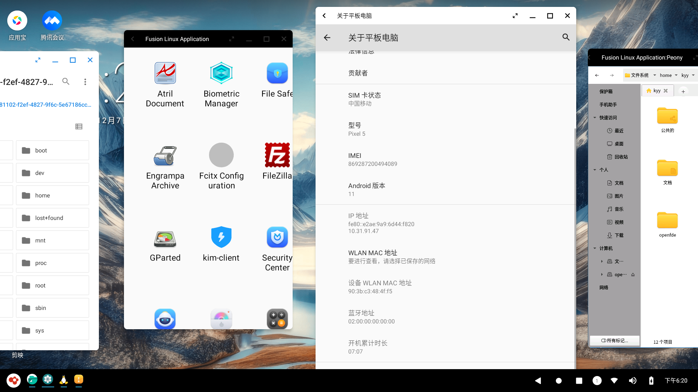
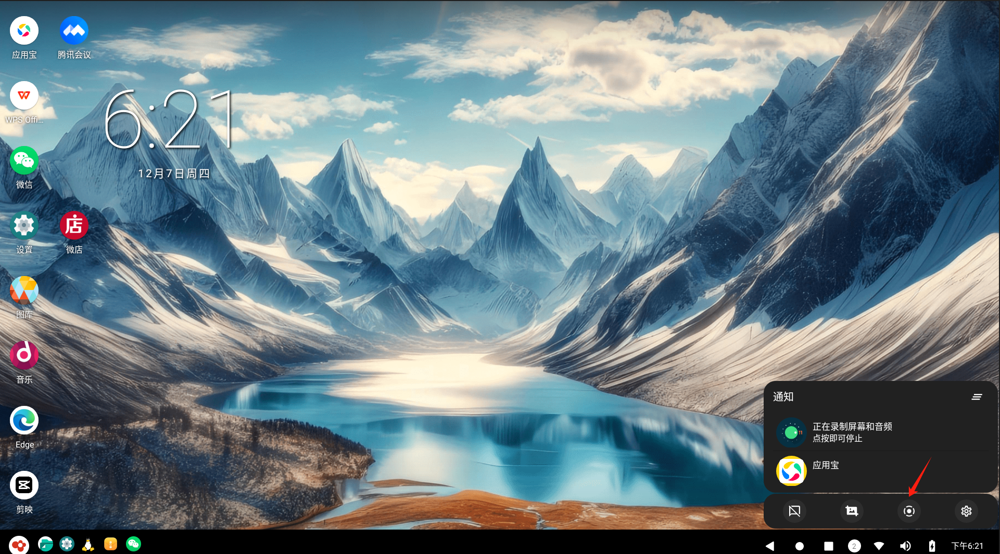
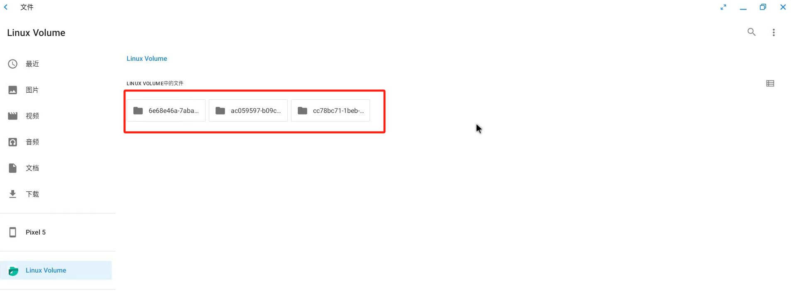
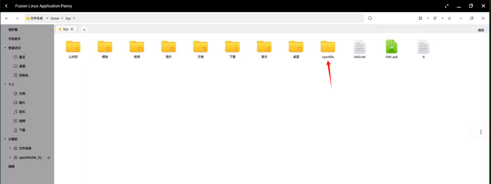

# v1.0.3版本更新内容

## 新增功能

### 支持拖动窗口越过屏幕左边界限

&emsp;&emsp;支持窗口拖动到界面外，使得屏幕布局更加灵活。允许用户将窗口随意放置在屏幕的不同位置，不再受限于屏幕边缘，屏幕布局更加灵活。

### 去除录屏时长和文件大小两个限制

&emsp;&emsp;在桌面底部状态栏-通知中心处的快捷方式中，点击录屏，不再限制录屏的时长和视频的文件大小。

### 文件系统融合支持逻辑卷挂载

&emsp;&emsp;在开始菜单的应用列表中，打开Android文件管理，点击左侧栏"Linux Volume"即可直接访问Linux的多个逻辑卷。

### 支持HOME/openfde写权限
  
&emsp;&emsp;在Linux融合应用列表中打开Pony，支持将Linux下的文件写入到HOME/opende目录下。例如，将linux的/home/kyy/hello.txt文件拷贝到/home/kyy/openfde/目录下

## 修复问题

- 修复Linux融合应用中输入法shift按键不弹起的问题
- 修复x100录屏卡顿问题
- 修复Linux融合应用连接报too many security failures的问题
- OpenFDE重启后，不再直接进入OpenFDE桌面，而是停留在登录框
