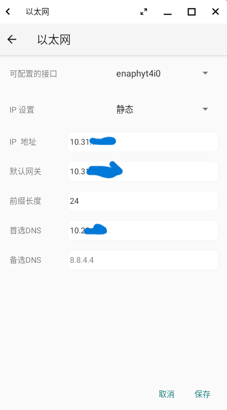

# v1.0.5版本更新内容

## 新增功能

此次版本更新无新增功能。

## 修复问题

- 修复蓝信报root环境，不能正常运行的问题。
- 修复在wifi连接状态下，进入OpenFDE时应用宝无法下载app的问题。

## 优化

**应用宝下载软件时鼠标卡顿优化**

优化了在Phytium X100笔记本上打开应用宝下载软件时导致鼠标卡顿的问题。

**网络设置界面优化**

在安卓端打开网络设置界面，能显示在linux设置的静态ip地址，也能显示DHCP的ip地址。

**应用睡眠后唤醒状态优化**

优化了Phytium X100笔记本中OpenFDE睡眠状态下，当应用在前台时，重新唤醒OpenFDE后桌面是黑色的问题；同时增加了唤醒后自动进入锁屏界面。